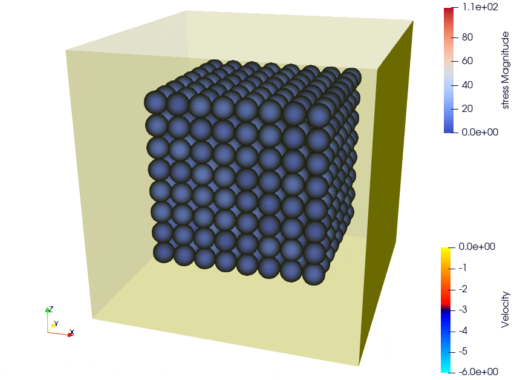
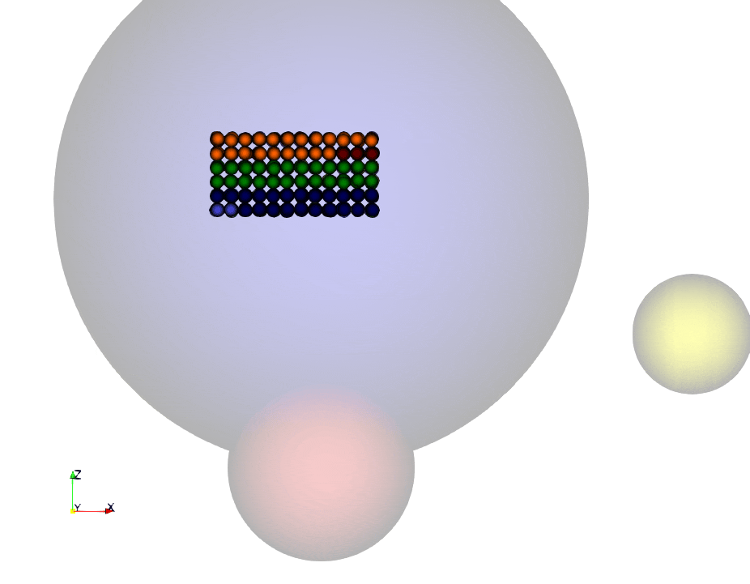
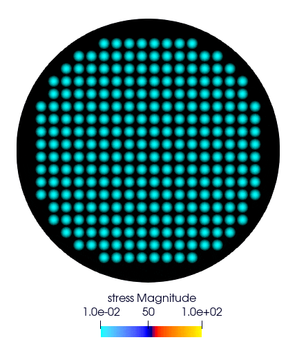
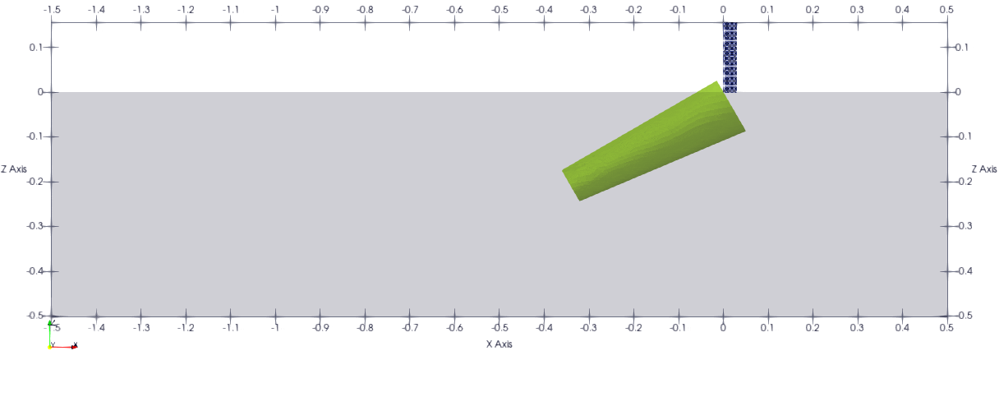
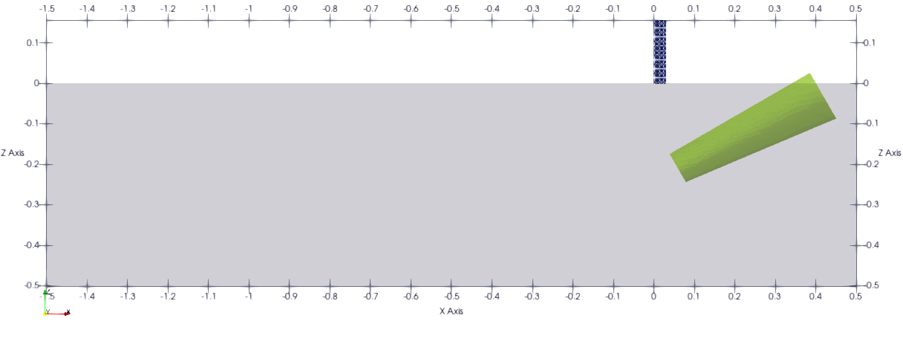
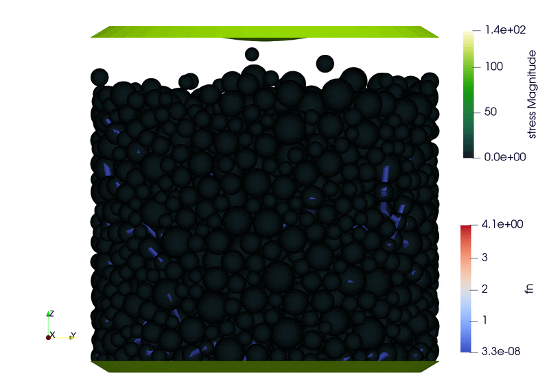
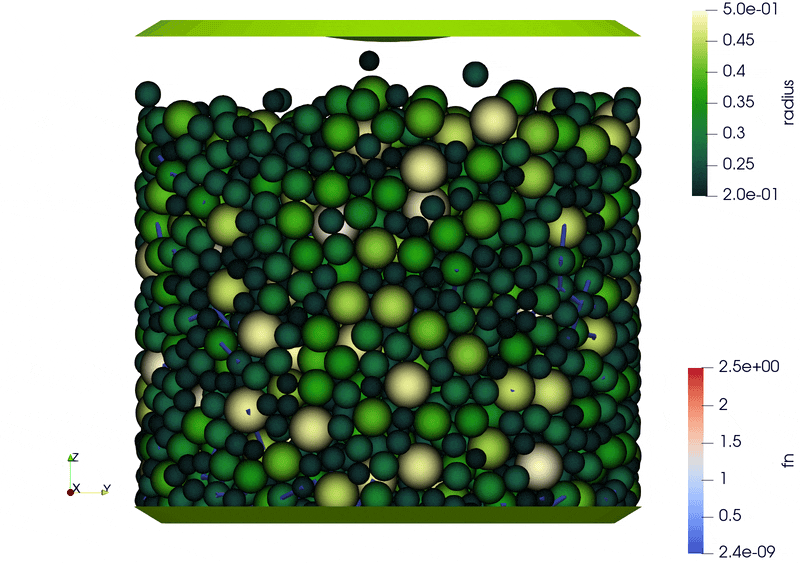

Drivers
=======

This section provides an overview of the ``drivers`` implemented in ``ExaDEM``, followed by a detailed description of each ``driver`` integrated into the system.

Quick Overview of Drivers
^^^^^^^^^^^^^^^^^^^^^^^^^

What is a driver in ExaDEM
--------------------------

In ``ExaDEM``, a ``driver`` denotes a significant shape, such as walls, cylinders, or other geometric forms, which are treated differently from particles due to their unique characteristics. While the ExaDEM framework has been optimized and parallelized to effectively handle particles and polyhedra of comparable scales, ``drivers`` necessitate special treatment owing to their distinct properties. To accommodate multiple ``drivers`` in a simulation, ExaDEM offers flexibility through the creation of a ``drivers`` list. This feature allows users to include any number of ``drivers`` required to define boundary conditions and obstacles within the simulation environment.

The current implementation of ``ExaDEM`` includes a variety of ``drivers``, each serving specific purposes within the simulation framework. The detailed list of implemented ``drivers`` is provided in the following table:

.. list-table:: Glossary Of Drivers
   :widths: 25 25 25
   :header-rows: 1

   * - Name         
     - Driver Type 
     - Operator Name
   * - Cylinder
     - ``CYLINDER`` 
     - ``register_cylinder``
   * - Wall / Surface 
     - ``SURFACE`` 
     - ``register_surface``
   * - Ball / Sphere  
     - ``BALL``       
     - ``register_ball``
   * - STL Mesh 
     - ``STL_Mesh`` 
     - ``register_stl_mesh``
   * - Undefined
     - ``UNDEFINED`` 
     - no operator

.. note::
 When adding a ``driver`` to the simulation in ``ExaDEM``, it is essential to define a contact parameter list specific to the ``driver`` within the `compute_contact_interaction` operator.

Common Driver Parameters
------------------------

Drivers share common parameters contained in the Driver_params class. These parameters are mainly used in the time integration scheme to detect the type of displacement. In the tables below, we describe the types of motion available by drivers and as well as a list of motions available on the driver:

.. list-table:: Glossary Of Motion Types
   :widths: 25 25
   :header-rows: 1

   * - Motion type
     - Description
   * - ``STATIONARY``
     - Stationary state with no translational motion, allowing rotations of Drivers.
   * - ``LINEAR_MOTION``
     - Linear movement type, straight-line motion at constant velocity
   * - ``COMPRESSIVE_FORCE``
     - Movement influenced by compressive forces, depending on driver type.
   * - ``LINEAR_FORCE_MOTION``
     - Linear motion driven by constant acceleration, incorporating the effects of the sample's resultant force.
   * - ``FORCE_MOTION``
     - General movement caused by applied forces
   * - ``LINEAR_COMPRESSIVE_MOTION``
     - Linear movement combined with compressive forces. 

.. list-table:: Glossary Of Motion Types per Driver
   :widths: 40 10 10 10 10 10 10
   :header-rows: 1

   * - Motion Type
     - ``STATIONARY``
     - ``LINEAR_MOTION``
     - ``COMPRESSIVE_FORCE``
     - ``LINEAR_FORCE_MOTION``
     - ``FORCE_MOTION``
     - ``LINEAR_COMPRESSIVE_MOTION``
   * - Cylinder
     - ✔
     - ✘
     - ✘
     - ✘
     - ✘
     - ✘
   * - Surface
     - ✔
     - ✔
     - ✘
     - ✘
     - ✘
     - ✔
   * - Ball
     - ✔
     - ✔
     - ✔
     - ✘
     - ✘
     - ✘
   * - Stl Mesh
     - ✔
     - ✔
     - ✘
     - ✔
     - ✘
     - ✔

For all these types of movement, the drivers adopt velocity Verlet integration time scheme. Below is a summary table showing how positions, forces or velocities are calculated according to the type of movement.

.. tabs::

   .. tab:: ``STATIONARY``

      .. math::
      
        P = P

      .. math::
        
        V = 0

      with :math:`P` the driver position, :math:`V` the driver velocity.

   .. tab:: ``LINEAR_MOTION``

      .. math::

        V = M_{vector} . C_{velocity}

      .. math::

        V = 0

      with :math:`P` the driver position, :math:`V` the driver velocity, :math:`M_{vector}` the motion vector, and :math:`C_{velocity}` the value of the [constant] velocity.

   .. tab:: ``COMPRESSIVE_FORCE``

      For spheres (or Ball), we adapte the scalar adius value (radius (:math:`R`),  :math:`R_{velocity}`, :math:`R_{acceleration}`):

      .. math::

         R_{acceleration} = \frac{F_{driver} - \sigma . S - damprate . R_{velocity}}{0.5 . m_{system}}
 

      with :math:`S`, the driver surface, :math:`m_{system}` the mass of the system, and math:`damprate` the damprate (TODO complete).

   .. tab:: ``LINEAR_FORCE_MOTION``

      .. math::

         F = ( dot(F_{driver}, M_{vector}) + C_F) . M_{vector}
 
      with :math:`F` the driver forces, :math:`F_{driver}` the sum of the forces applied to the driver by the particles, :math:`C_F` the value of the [constant] force, and :math:`M_{vector}` the motion vector.

   .. tab:: ``FORCE_MOTION``

      .. math::

         F = F_{driver}

      with :math:`F` the driver forces and :math:`F_{driver}` the sum of the forces applied to the driver by the particles.

   .. tab:: ``LINEAR_COMPRESSIVE_MOTION``

      .. math::

         F = (dot(M_{vector}, F_{driver}) - \sigma . S - damprate . V) . M_{vector}

      with :math:`F` the driver forces, :math:`V` the driver velocity, :math:`S`, the driver surface, :math:`damprate` the damprate (TODO complete), and :math:`M_{vector}` the motion vector. 

And keywords:

	- ``motion_vector``: :math:`M_{vector}`, slot ``params``
	- ``const_vel``: :math:`C_{velocity}`, slot ``params``
	- ``const_f``: :math:`C_F`, slot ``params``
	- ``damprate``: :math:`damprate`, slot ``params``

Add a Driver To Your Simulation
-------------------------------

In ``ExaDEM``, ``drivers`` are managed differently depending on whether spheres or polyhedra are used in the simulation. Forces are computed per interaction for polyhedra, while forces are computed and summed per sphere body:

  * Using spheres, a special contact force is added to handle interactions with drivers in the ``contact_force_driver`` operator.
  * Using polyhedra, special interactions (described in the Polyhedra section) are added to the interaction lists. Additionally, you need to specify your driver list in the list of operators called ``setup_drivers``, which is integrated into the default ``ExaDEM`` execution. It's crucial to specify an ID for each driver. If you create a second driver with an already used ID, it will overwrite the previous driver configuration.

Driver Descriptions
^^^^^^^^^^^^^^^^^^^

In this section, we provide brief descriptions of available ``drivers``. Please note that a test case is defined for each ``driver`` in the ``example`` directory.

Rotating Drum / Cylinder
-------------------------

The rotating drum or cylinder driver represents an infinite cylinder rotating along a specified axis. It is defined by parameters including its middle, velocity, axis, and angular velocity.

.. |ex1end| image:: ../_static/rotating_drum_end.png
   :align: middle
   :width: 300pt

|ex1end|

* Operator name: ``register_cylinder``
* Description: This operator adds a cylinder to the drivers list.
* Parameters:

  * *id*: Driver index
  * *state*: Current cylinder state, default is {radius: REQUIRED, axis: REQUIRED, center: REQUIRED, vel: [0,0,0], vrot: [0,0,0], rv: 0, ra: 0}. You need to specify the radius and center.
  * *params*: List of params, motion type, motion vectors .... Default is { motion_type: STATIONARY}.

YAML example:

.. code:: yaml

  - register_cylinder:
     id: 0
     state: {center: [2.5, 2.5, 2.5], axis: [1, 0, 1], radius: 4}
     params: { motion_type: STATIONARY }

Wall / Surface
--------------

The wall or surface driver represents an infinite wall within the simulation environment. It is defined by parameters including its normal vector, offset, and velocity. Please note that currently, no angular velocity is defined for this driver. 

.. |ex4end| image:: ../_static/rigid_surface_end.png
   :align: middle
   :width: 300pt

|ex4end|

* Operator name: ``register_surface``
* Description: This operator adds a surface/wall to the drivers list.
* Parameters:

  * *id*: Driver index
  * *state*: 
  * *params*: 

YAML examples:

.. code:: yaml

  - register_surface:
     id: 0
     state: {normal: [0,0,1], offset: -0.5}
     params: { motion_type: STATIONARY }

.. code:: yaml

  - register_surface:
     id: 4
     state: { normal: [1,0,0], offset: 11}
     params: { motion_type: LINEAR_MOTION, motion_vector: [1,0,0], const_vel: -4 }

.. code:: yaml

  - register_surface:
     id: 4
     state: { normal: [1,0,0], offset: 11, surface: 144}
     params: { motion_type: LINEAR_COMPRESSIVE_MOTION, motion_vector: [1,0,0], sigma: 0.5, damprate: 0.999 }

|surface_radial_stress|

.. note:: 

  If you have chosen the “LINEAR_COMPRESSIVE_MOTION” mode, you will need to define the value of the wall surface.  

Ball / Sphere
--------------

The ball or sphere driver represents a spherical object within the simulation environment. It is defined by parameters including its center, velocity, and angular velocity. This driver can be utilized as a boundary condition or obstacle in the simulation.

.. |ex3pend| image:: ../_static/ExaDEM/polyhedra_ball_end.png
   :align: middle
   :width: 300pt

|ex3pend|

* Operator name: ``register_ball``
* Description: This operator adds a ball / sphere (boundary condition or obstacle) to the drivers list.
* Parameters:

  * *id*: Driver index
  * *state*: Current ball state, default is {radius: REQUIRED, center: REQUIRED, vel: [0,0,0], vrot: [0,0,0], rv: 0, ra: 0}. You need to specify the radius and center. 
  * *params*: List of params, motion type, motion vectors .... Default is { motion_type: STATIONARY}.

.. note::

   - `ra` is the "radius acceleration" and `rv` the "radius velocity" used during the radial compression, i.e. shrinking or stretching the radius of a ball until the desired pressure is reached between the ball and the particles inside. This requires the motion type ``COMPRESSIVE_FORCE``.

   - If the motion type is ``LINEAR_MOTION``, the velocity (`vel`) is computed from `motion_vector` and `const_vel`.

   - If the motion type is ``COMPRESSIVE_FORCE``, the velocity (`vel`) is set to 0.

YAML examples:

Motion type: Stationay

.. code:: yaml

  - register_ball:
     id: 2
     state: {center: [2,2,-20], radius: 7}
     params: { motion_type: STATIONARY }

Motion type: linear motion

.. code:: yaml

  - register_ball:
     id: 1
     state: {center: [30,2,-10], radius: 8}
     params: { motion_type: LINEAR_MOTION , motion_vector: [-1,0,0], const_vel: 0.5}

|ball_linear_motion|

Motion type: Compressive

.. code:: yaml

  - register_ball:
     id: 0
     state: {middle: [0,0,0], radius: 11}
     params: {motion_type: COMPRESSIVE_FORCE , sigma: 1.0, damprate: 0.999}

|radial_stress|

STL Mesh
--------

The STL Mesh driver is constructed from an .STL (Stereolithography) file to create a mesh of faces. This approach enables the rapid setup of complex geometries within the simulation environment. It's important to note that faces in an STL mesh are processed as a sphere polyhedron, meaning a small layer is added around each face.

.. |ex4pendmixte| image:: ../_static/ExaDEM/stl_mixte_end.png
   :align: middle
   :width: 300pt

|ex4pendmixte|

* Operator name: ``register_stl_mesh``    
* Description: This operator adds an "STL mesh" to the drivers list.
* Parameters:

  * *id*: Driver index
  * *filename*: Input filename (.stl or .shp)
  * *minskowski*: Minskowski radius value
  * *state*: Define the center, velocity, angular velocity and the orientatation. Default is: state: {center: [0,0,0], vel: [0,0,0], vrot: [0,0,0], quat: [1,0,0,0]}.
  * *params*: List of params, motion type, motion vectors .... Default is { motion_type: STATIONARY}.

* Operator name: ``update_grid_stl_mesh``
* Description: Update the grid of lists of {vertices / edges / faces} in contact for every cell. The aim is to predefine a list of possible contacts with a cell for an STL mesh. These lists must be updated each time the grid changes. 
* Parameters: No parameter

YAML examples:

Staionary mode:

.. code:: yaml

  - register_stl_mesh:
     id: 0
     filename: mesh.stl
     minskowski: 0.001 m
     params: {motion_type: STATIONARY}

|ex4stationary| 

Linear motion mode:

.. code:: yaml

  - register_stl_mesh:
     id: 0
     state: {center: [0.4,0,0]}
     params: { motion_type: LINEAR_MOTION, motion_vector: [-1,0,0], const_vel: 0.5 }
     filename: mesh.stl
     minskowski: 0.001 m

|ex4linearmotion|

Linear force motion mode:

.. code:: yaml

  - register_stl_mesh:
     id: 1
     filename: piston_haut.stl
     scale: 0.5002
     minskowski: 0.001
     state: { center: [0.0, 0.0, 9.], vel: [0,0,-0.025], quat: [1,0,0,0], mass: 1}
     params: { motion_type: LINEAR_FORCE_MOTION, motion_vector: [0,0,-1], const_force: 100 }

|ex4linearforcemotion|

.. note::

  You need to define the mass of your driver.  

Linear compression motion mode:

.. code:: yaml

  - register_stl_mesh: 
     id: 1 
     filename: piston_haut.stl 
     scale: 0.5002 
     minskowski: 0.001 
     state: { center: [0.0, 0.0, 9.], vel: [0,0,-0.025], quat: [1,0,0,0], mass: 1, surface: 1.6146970415e+02} 
     params: { motion_type: LINEAR_COMPRESSIVE_MOTION, motion_vector: [0,0,-1], sigma: 0.5, damprate: 0.5 } 

|ex4linearcompressionmotion|

.. note::

  You will need to define the mass and the surface of your driver. If you don't specify a surface, `exaDEM` will propose to you a value corresponding to the sum of the face surfaces composing the stl mesh. 

I/O Drivers
^^^^^^^^^^^

An input/output system has been implemented primarily for drivers performing movements, such as a rigid surface compressing a sample or a blade rotating around an axis.

The drivers' output is automatically triggered when the user sets the global variable: ``simulation_dump_frequency``. This command also allows particles and interactions to be stored in a separate file. The drivers are then saved in a file located at ``ExaDEMOutputDir/CheckpointFiles/driver_%010d.msp``, containing the drivers' information. In the case of an ``STL mesh`` driver, a shp file is added to the ``ExaDEMOutputDir/CheckpointFiles/`` directory, which contains the geometry of the ``STL mesh``.To restart the driver along with your simulation, simply include the ``.msp`` file containing the ``setup_driver`` operator block at the beginning of your restart file.

YAML example: 

.. code:: yaml

  grid_flavor: grid_flavor_dem
  includes:
    - config_spheres.msp
    - ExaDEMOutputDir/CheckpointFiles/driver_0000040000.msp
  global:
    simulation_dump_frequency: 10000

Similarly, ExaDEM saves ``STL meshes`` each time a Paraview output is generated by setting the global variable: ``simulation_paraview_frequency``. The ``STL mesh`` is then translated and oriented correctly in the ``ExaDEMOutputDir/ParaviewOutputFiles/`` directory as ``shape_name_iteration.vtk``.

Another feature displays the driver summary. To do this, use the print_drivers operator, which is called by default when initializing an ``exaDEM`` simulation.

* Operator name: ``print_drivers``
* Description: This operator prints drivers.

YAML example:

.. code:: yaml

  - print_drivers

Output example:

.. code-block:: bash

  ==================== Driver Configuraions =======================
  ===== Summary
  Drivers Stats
  Number of drivers: 3
  Number of Cylinders: 1
  Number of Surfaces: 0
  Number of Balls: 0
  Number of Stl_meshs: 2
  Number of Undefined Drivers: 0
  ===== List Of Drivers
  Driver [0]:
  Driver Type: MESH STL
  Name   : base
  Center : 0,0,-20
  Vel    : 0,0,0
  AngVel : 0,0,0
  Quat   : 1 0 0 0
  Number of faces    : 52
  Number of edges    : 150
  Number of vertices : 100
  Driver [1]:
  Driver Type: Cylinder
  Radius: 25
  Axis  : 1,1,0
  Center: 0,0,0
  Vel   : 0,0,0
  AngVel: 0,0,0
  Driver [2]:
  Driver Type: MESH STL
  Name   : palefine
  Center : 0,0,1.5
  Vel    : 0,0,-0.0174
  AngVel : 0,0,-0.004
  Quat   : 1 0 0 0
  Number of faces    : 25952
  Number of edges    : 77856
  Number of vertices : 31647
  =================================================================

Advanced Operators
^^^^^^^^^^^^^^^^^^

Update Grid For STL Mesh
------------------------

The purpose of this operator is to project the STL mesh onto the cells making up the exaDEM grid in order to speed up the search for interactions. Each grid cell is then assigned a set of vertices, edges, and faces that are potentially in contact with the cell's particles.

* Operator name: ``grid_stl_mesh``    
* Description: Update the list of information for each cell regarding the vertex, edge, and face indices in contact with the cell in an STL mesh.
* Parameters:

  * *force_reset*: Force to rebuild grid for STL meshes

.. note::

  [1] This operator only projects the STL mesh onto the grid making up the MPI process subdomain. If the subdomain changes, the update must be forced (force_reset=0). 
  [2] If the stl mesh is stationary (v= null, vrot=null), the grid is not updated. This speeds up calculations when the STL mesh has many elements.

YAML example: 

.. code:: yaml

  - compute_driver_vertices:
     force_reset: true

Compute Driver Vertices
-----------------------

This operator is used to update the vertex positions of operators with vertices. For the moment, this operator is only used for STL meshes and to fill in the `vertices` field.

* Operator name: ``compute_driver_vertices``    
* Description: This operator calculates new vertex positions.
* Parameters:

  * *force_host*: Force computations on the host

.. note::

  For GPU performance reasons, you may decide not to update the GPU data directly, knowing that it will be used to build the CPU interaction list.

YAML example: 

.. code:: yaml

  - compute_driver_vertices:
     force_host: false

Check Driver Displacement
-------------------------

This operator detects if a driver has moved more than 1/2 of the Verlet radius. This operator works in combination with the backup_driver operator to store driver data at the iteration when the interaction lists have been recalculated. 

* In the case of a sphere, we test the distance between the two centers.
* In the case of an STL mesh, we check the displacement of all vertices.
* In the case of a cylinder, this option is disabled.
* In the case of a wall, we look at the difference between the offset values.

Currently, for the GPU version, these tests are carried out on the CPU, except for the detection of stl meshes, which requires a reduction operation. Operator characteristic: 

* Operator name: ``driver_displ_over``
* Description: It computes the distance between each particle in grid input and its backup position in backup_dem input. It sets result output to true if at least one particle has moved further than threshold.
* Parameters: 

  * threshold: Defined by the simulation (deduced from `rcut_inc`)

YAML example:

.. code:: yaml

  - driver_displ_over

