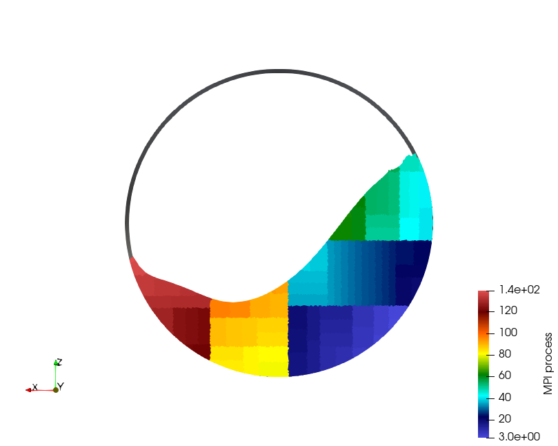
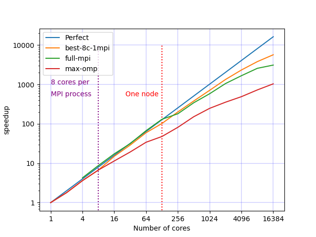
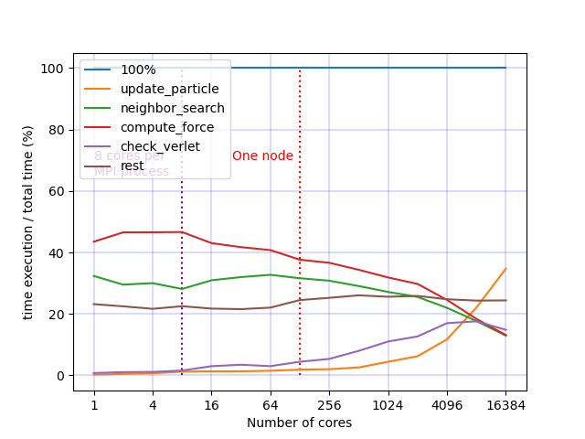

Parallelization
===============

MPI Parallelization
^^^^^^^^^^^^^^^^^^^

Domain Decomposition
--------------------

Cost Model
----------

The weight associated with each cell used for load distribution using the RCB method is as follows: 

.. math::

   W_i=1+3.P_i+\sum_{j \in {0,...,N_i}}[F(I_i[j].type)]

with :math:`W_i` the array of weights, ``i`` is the cell id, :math:`I_i` the interactions into the cell ``i`` , :math:`P_i` the number of particle into the cell ``i``, :math:`N_i` is number of interactions and ``F`` is the cost function associated to the interaction type.

.. list-table:: F values
   :widths: 20 25 20
   :header-rows: 1

   * - Value
     - Type 
     - F(Value)
   * - 0
     - Vertex - Vertex
     - 1
   * - 1
     - Vertex - Edge
     - 3
   * - 2
     - Vertex - Face
     - 5
   * - 3
     - Edge - Edge
     - 4
   * - 4
     - Vertex - Cylinder
     - 1
   * - 5
     - Vertex - Surface
     - 1
   * - 6
     - Vertex - Ball
     - 1
   * - 7
     - Vertex - Vertex (STL)
     - 1
   * - 8
     - Vertex - Edge (STL)
     - 3
   * - 9
     - Vertex - Face (STL)
     - 5
   * - 10
     - Edge - Edge (STL)
     - 4
   * - 11
     - Vertex (STL) - Edge
     - 3
   * - 12
     - Vertex (STL) - Face
     - 5

Thread Parallelization
^^^^^^^^^^^^^^^^^^^^^^

GPU Support
^^^^^^^^^^^

Benchmarks
^^^^^^^^^^

Rotating Drum - CPU (Sphere)
----------------------------

.. |bench1-picture| image:: ../_static/mpi-dem-example-100M-modified.png

.. |bench1-graph2| image:: ../_static/drum_dem_100M_comp.png

This benchmark has been presented in 2023 within the paper :cite:`Carrard_2024` : "ExaNBody : a HPC framework for N-Body applications"

Description:

Different OpenMP/Mpi configurations (number of cores/threads per ``mpi`` process) have been tested to balance multi-level parallelism. 
Both simulations were instrumented during 1,000 representative iterations. 
The performance of ``ExaDEM`` was evaluated using up to 256 cluster nodes, built on bi-socket 64-core AMD EPYC ``Milan`` 7763 processors running at 2.45 GHz and equipped with 256 GB of RAM.

.. figure:: ../_static/mpi-dem-example-100M-modified.png
   :scale: 90%
   :align: center

   Dem simulation of 100 million spheres in a rotating drum.

ExaDEM's performance is evaluated with a simulation of a rotating drum containing 100 million spherical particles, see Figure below. 
This setup is a tough benchmark as particles are rapidly moving all around the heterogeneously dense domain, due to gravity. 
Additionally, the employed contact force model has a low arithmetic intensity, and ``exaDEM`` must handle pairwise friction information, that is updated by kernel and must migrate between ``mpi`` processes when subdomains are redistributed. 

   Domain decomposition of 100 000 of spheres into a rotating drum

   Speedup for different OpenMP/Mpi configurations. ExaDEM simulation with 1, 8, and 128 threads per ``mpi`` process.

.. note::

  Note that the ``Milan`` nodes are made up of 128 cores spread over 8 NUMA nodes, and we have pointed out that NUMA effects reduce overall performance.

.. figure:: ../_static/drum_dem_100M_comp.png
   :scale: 70%
   :align: center

   Operator speedup according to the total number of cores used.

   Operator time ratios at different paralellization scales.

Rotating Drum - GPU (Polyhedron)
--------------------------------

This example is defined in the repository: https://github.com/Collab4exaNBody/exaDEM-benchmark/tree/main/rotating-drum-poly . This simulation is run on an a100 GPU using 32 cores. Result format: Loop time (Update Particles/Force Field).

.. list-table:: GPU Benchmarks
   :widths: 20 40 40
   :header-rows: 1

   * - Version
     - Case 10k 
     - Case 80K
   * - v1.0.1 (06/24)
     - 28.1(17.1/6.8)
     - 71.6(37.8/26.0)
   * - v1.0.2 (11/24)
     - 23.3(17.7/4.1)
     - 48.9(33.0/13.8)
   * - master (05/12/24)
     - 6.38(2.61/2.49)
     - 17.6(11.65/4.3)

Polyhedra Into A Box
--------------------
