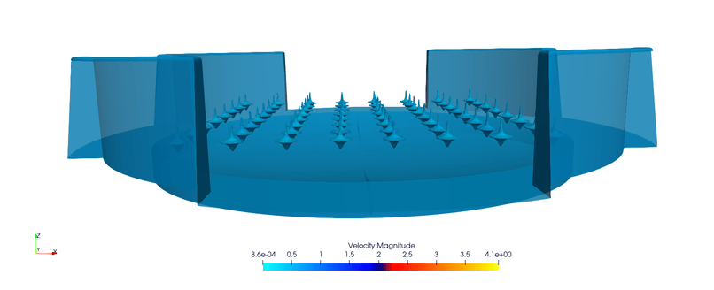
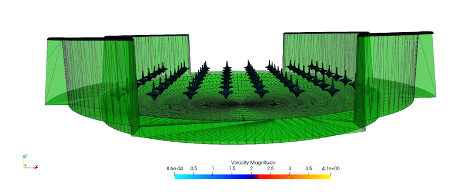

Public Examples
===============

This section lists a set of public examples illustrating some of the possibilities of ``exaDEM``, but which are not necessarily intended to be maintained.

Example 1
---------

Repository: https://github.com/Collab4exaNBody/exadem-public-examples/tree/main/ex1

* Version tested: ``v1.1.6``
* Particle type: cylinder
* Driver type: Cylinder
* Motion type: ``STATIONNARY`` with Rotation

.. figure:: ../_static/ex1_vel.gif
   :scale: 70%
   :align: center

.. figure:: ../_static/ex1_id.gif
   :scale: 70%
   :align: center

Example 2
---------

Repository: https://github.com/Collab4exaNBody/exadem-public-examples/tree/main/ex2

* Version tested: ``v1.1.6``
* Particle type: Toupie
* Drvier type: STL
* Motion type: ``STATIONNARY``

