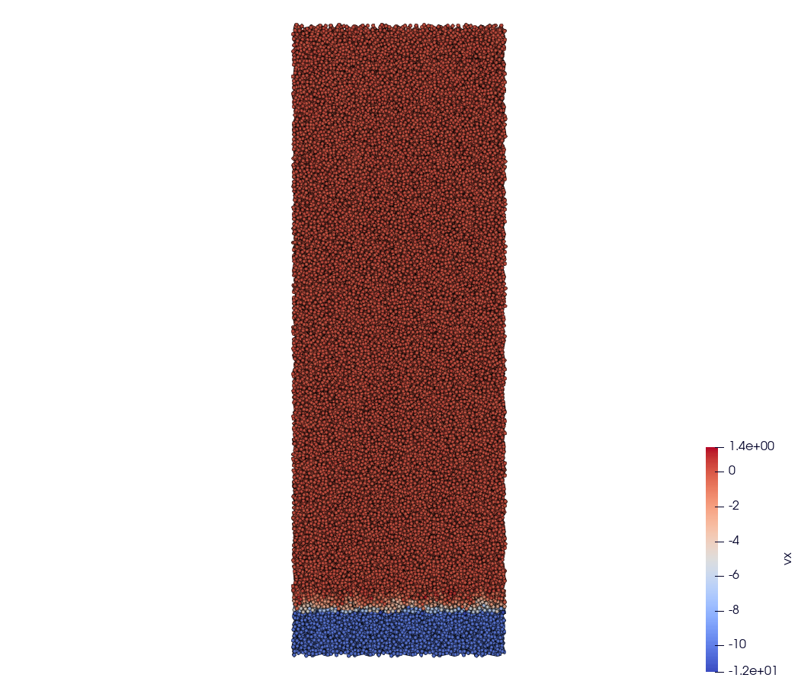
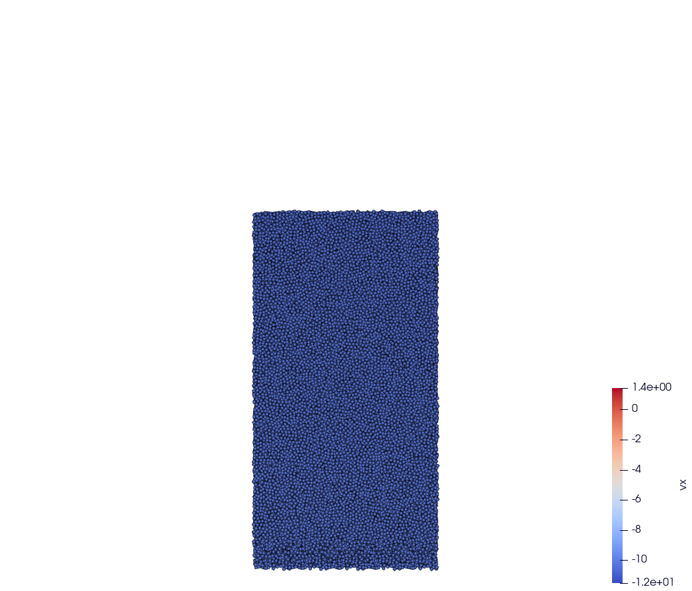
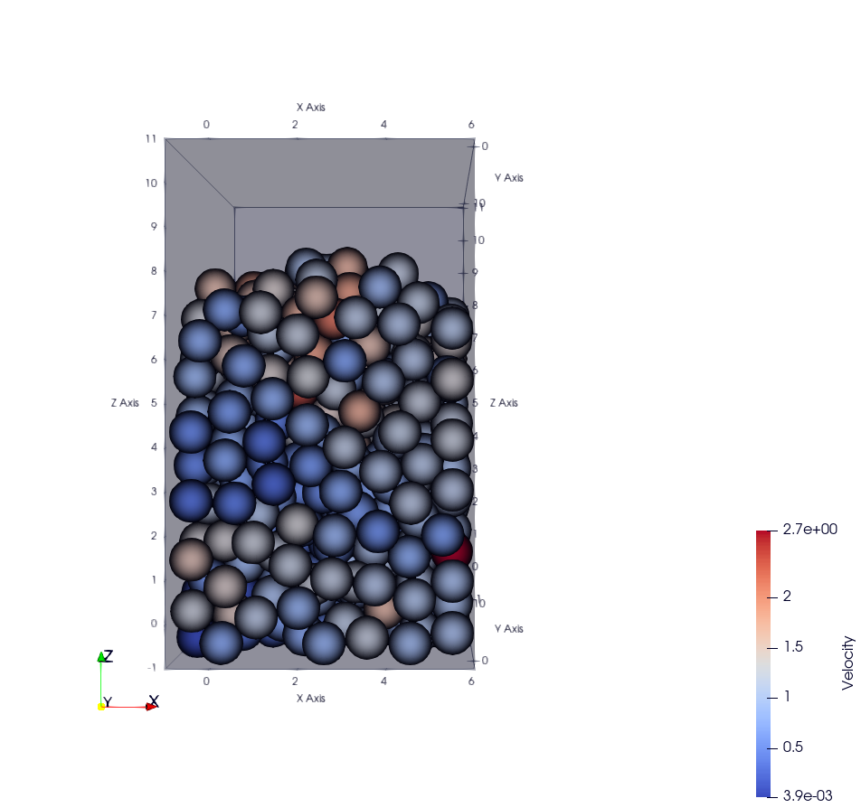
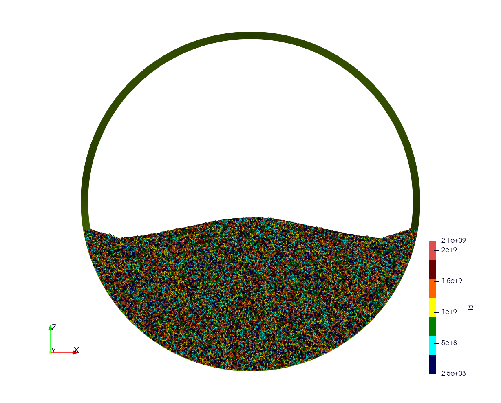
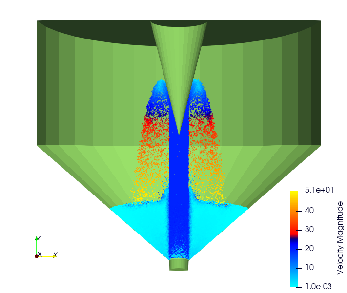
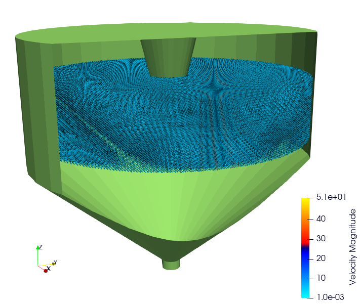
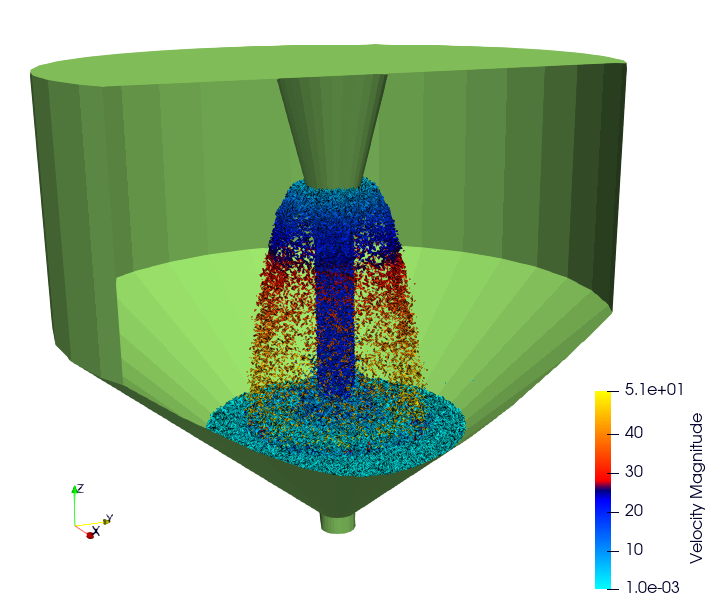
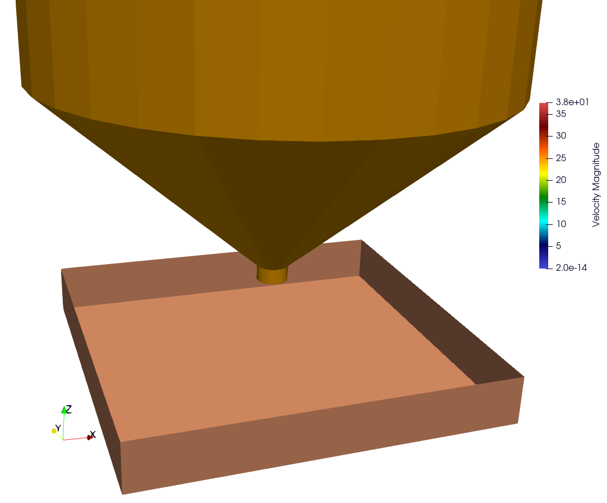

Test cases
==========

You can explore various basic test cases located in the `example` directory. These test cases serve as illustrative examples of ExaDEM's functionality and can assist you in understanding its behavior and capabilities.

Example Using Spheres
---------------------

All examples with spheres can be found in the directory: ``exaDEM/example/spheres/``.

Example 1: Rotating drum
^^^^^^^^^^^^^^^^^^^^^^^^

A DEM simulation of a set of spheres in a periodic rotating drum. Through this simulation, we can observe how particles interact, collide, and move in response to the drum's motion. This provides insights into phenomena like particle segregation, convection currents, and mixing patterns, contributing to improved understanding of granular material behavior in rotational scenarios. A second scenario without periodic conditions is available, with two rigid surfaces fixed to the end of the drum.  

.. |ex1npstart| image:: ../_static/ExaDEM/rotating_drum_no_periodic_start.png
   :width: 300pt

.. |ex1npend| image:: ../_static/ExaDEM/rotating_drum_no_periodic_end.png
   :width: 300pt

- Input files:

  - First test case: ``exaDEM/example/spheres/rotating-drum/rotating-drum-full.msp``
  - Second test case: ``exaDEM/example/spheres/rotating-drum/rotating-no-periodic.msp``

+--------------------------+--------------------------+
| .. centered:: Rotating Drum                         |
+--------------------------+--------------------------+
| .. centered:: Start      | .. centered:: End        |
+==========================+==========================+
| |ex1start|               | |ex1end|                 |
+--------------------------+--------------------------+
| |ex1npstart|             | |ex1npend|               |
+--------------------------+--------------------------+

Example 2: Rigid stress
^^^^^^^^^^^^^^^^^^^^^^^

In a DEM simulation under radial stress, particles are exposed to an attractive force from a central point. This scenario allows us to analyze how particles within a system react to the applied radial stress. The simulation offers insights into particle rearrangements, contact forces, and structural changes, giving us a deeper understanding of granular material behavior under radial loading conditions.

.. |ex3start| image:: ../_static/radial_stress_start.png
   :width: 300pt

+--------------------------+--------------------------+
| .. centered:: Radial Stress                         |
+--------------------------+--------------------------+
| .. centered:: Start      | .. centered:: End        |
+==========================+==========================+
| |ex3start|               | |ex3end|                 |
+--------------------------+--------------------------+

.. warning:: This example is currently disabled.

Example 3: Rigid surface
^^^^^^^^^^^^^^^^^^^^^^^^

A DEM simulation involving spherical particles falling onto a rigid surface offers a virtual exploration of particle dynamics in a gravity-driven scenario. This simulation captures the behavior of individual spherical particles as they fall and interact with a solid surface below. 

- Input file: ``example/spheres/rigid-surface/rigid_surface_full.msp``

.. |ex4start| image:: ../_static/rigid_surface_start.png
   :width: 300pt

.. |ex4end| image:: ../_static/rigid_surface_end.png
   :width: 300pt

+--------------------------+--------------------------+
| .. centered:: Rigid Surface                         |
+--------------------------+--------------------------+
| .. centered:: Start      | .. centered:: End        |
+==========================+==========================+
| |ex4start|               | |ex4end|                 |
+--------------------------+--------------------------+

Example 4: Impose Velocity
^^^^^^^^^^^^^^^^^^^^^^^^^^

In this DEM simulation, a scenario is simulated where a group of particles with imposed velocity occupies a defined area. As other particles fall into this region, they interact with the moving particles, impacting their trajectories. The simulation provides insights into how moving driver particles influence the behavior of surrounding particles. Example: ``impose_velocity_hole``, credit: ``lafourcadp``.  

- Input files:

  - The first test case: ``exaDEM/example/spheres/impose_velocity/impose_velocity_full.msp``
  - The second test case: ``exaDEM/example/spheres/impose_velocity/impose_velocity_hole.msp``

.. |ex5end2| image:: ../_static/ExaDEM/impose_vel_hole_end.png
   :width: 300pt

+--------------------------+--------------------------+
| .. centered:: Impose Velocity                       |
+--------------------------+--------------------------+
| .. centered:: Start      | .. centered:: End        |
+==========================+==========================+
| |ex5start|               | |ex5end|                 |
+--------------------------+--------------------------+
| |ex5start2|              | |ex5end2|                |
+--------------------------+--------------------------+

Example 5: Movable wall
^^^^^^^^^^^^^^^^^^^^^^^

In this DEM simulation, a cluster of spherical particles is compacted against a rigid surface. A piston is introduced to apply a steadily increasing stress that linearly evolves over time. This simulation captures the dynamics as the piston's force gradually grows. As the piston imparts its stress, the particle block undergoes deformation and stress propagation. 

- Input file: ``exaDEM/example/spheres/movable-wall/movable_wall.msp`` 

+--------------------------+--------------------------+
| .. centered:: Movable Wall                          |
+--------------------------+--------------------------+
| .. centered:: Start      | .. centered:: End        |
+==========================+==========================+
| |ex6start|               | |ex6end|                 |
+--------------------------+--------------------------+

Example 6: Using an STL Mesh
^^^^^^^^^^^^^^^^^^^^^^^^^^^^

In this DEM simulation, a cluster of spherical particles falls onto an .stl mesh and into a box. This case study highlights the use of meshes containing numerous facets and allows adding all geometries coming from CAD or graphic design. 

- Input file: ``example/spheres/mesh-stl/mesh_stl_full.msp``

.. |ex7start| image:: ../_static/mesh_stl_start.png
   :width: 300pt

.. |ex7end| image:: ../_static/mesh_stl_end.png
   :width: 300pt

+--------------------------+--------------------------+
| .. centered:: Mesh STL                              |
+--------------------------+--------------------------+
| .. centered:: Start      | .. centered:: End        |
+==========================+==========================+
| |ex7start|               | |ex7end|                 |
+--------------------------+--------------------------+

Example 7: Particle Generation With RSA Algorithm
^^^^^^^^^^^^^^^^^^^^^^^^^^^^^^^^^^^^^^^^^^^^^^^^^

In this DEM simulation, a cluster of 287,642 spherical particles has been generated by the parallelized `rsa` algorithm :cite:`JOSIEN2024109354`. Then, particles fall by gravity in a drum.

Input file: ``exaDEM/example/spheres/rsa/rsa-full.msp``

.. |ex8start| image:: ../_static/rsa_start.png
   :width: 300pt

.. note::

  ``rsa`` is an optional package, please see installation guildelines to add it.

+--------------------------+--------------------------+
| .. centered:: RSA                                   |
+--------------------------+--------------------------+
| .. centered:: Start      | .. centered:: End        |
+==========================+==========================+
| |ex8start|               | |ex8end|                 |
+--------------------------+--------------------------+

Example 8: Jet
^^^^^^^^^^^^^^

This example demonstrates the application of a velocity field to spheres based on a Cartesian grid projection. Although it does not represent a physical scenario, a geyser-like effect has been simulated using a cylindrical shape, directing the particle velocities towards a specified speed. Future developments will involve applying non-uniform velocity fields to simulate more complex fluid configurations. Input files are available here: ``exaDEM/example/spheres/jet/step1.msp and step2.msp`` but they don't correspond exactly to the pictures (fewer particles).

.. |ex10starthalf| image:: ../_static/ExaDEM/jet_half_start.png
   :width: 250pt

+--------------------------+--------------------------+
| .. centered:: Geyser Simulation                     |
+--------------------------+--------------------------+
| .. centered:: Start      | .. centered:: End        |
+==========================+==========================+
| |ex10starthalf|          | |ex10endhalf|            |
+--------------------------+--------------------------+
| |ex10startfull|          | |ex10endfull|            |
+--------------------------+--------------------------+

Example 9: Mirror Boundary Conditions
^^^^^^^^^^^^^^^^^^^^^^^^^^^^^^^^^^^^^

This example tests the mirror conditions available in exaNBody. Although these conditions are not directly applicable (" not physics "), because all fields are copied identically (without processing/filtering) at each time step in the ghost cells (e.g. velocity, moments), except for positions (axial symmetry). This example highlights this functionality and could potentially be coupled with other operators to develop new boundary conditions (e.g. resetting velocities to 0 to model a rigid surface). This example involves dropping 33,120 spheres, adding mirror boundary conditions in all directions, and letting them fall by gravity. 

- Input file: ``exaDEM/example/spheres/mirror/mirror.msp``. 

.. |ex11start| image:: ../_static/ExaDEM/mirror_start.png
   :width: 250pt

+--------------------------+--------------------------+
| .. centered:: Mirror Simulation                     |
+--------------------------+--------------------------+
| .. centered:: Start      | .. centered:: End        |
+==========================+==========================+
| |ex11start|              | |ex11end|                |
+--------------------------+--------------------------+

Examples Using Polyhedra
------------------------

All examples with polyhedra can be found in the directory: ``exaDEM/example/polyhedra/``.

Example 1: Polyhedra Generation Frequency
^^^^^^^^^^^^^^^^^^^^^^^^^^^^^^^^^^^^^^^^^

In this example, we simulate the generation of 100 new polyhedra at every 45000 time steps, representing their descent into a void environment. The primary objective is to illustrate the process of generating a lattice of polyhedra within a confined area. Additionally, we demonstrate the application of a series of operators to initialize various fields associated with the newly generated polyhedra. This example serves as a practical guide for setting up and executing simulations involving dynamic polyhedra generation and manipulation within defined spatial boundaries.

- Input file: ``example/polyhedra/generator/generator.msp``

.. |ex1pstart| image:: ../_static/generator_start.png
   :width: 250pt

.. |ex1pend| image:: ../_static/generator_end.png
   :width: 250pt

+--------------------------+------------------------------+
| .. centered:: Polyhedra Generation Frequency            |
+--------------------------+------------------------------+
| .. centered:: Start      | .. centered:: End            |
+==========================+==============================+
| |ex1pstart|              | |ex1pend|                    |
+--------------------------+------------------------------+

Example 2: Octahedra in a Rotating Drum
^^^^^^^^^^^^^^^^^^^^^^^^^^^^^^^^^^^^^^^

In this DEM simulation, we observe the dynamics of 125 octahedra as they descend into a rotating drum. The second test case contains 27,000 octahedra (yellow) and 27,000 hexapods (blue).

- Input files:

  - The first example: ``example/polyhedra/rotating_drum/rotating-drum.msp``
  - The second example: ``example/polyhedra/rotating_drum/rotating-drum-mixte.msp``

.. |ex2pstart| image:: ../_static/octahedra_rotating_drum_start.png
   :width: 250pt

.. |ex2pend| image:: ../_static/octahedra_rotating_drum_end.png
   :width: 250pt

.. |ex2pmixtestart| image:: ../_static/ExaDEM/rotating_drum_mixte_start.png
   :width: 250pt

.. |ex2pmixteend| image:: ../_static/ExaDEM/rotating_drum_mixte_end.png
   :width: 250pt

+--------------------------+--------------------------+
| .. centered:: Polyhedra Generation Frequency        |
+--------------------------+--------------------------+
| .. centered:: Start      | .. centered:: End        |
+==========================+==========================+
| |ex2pstart|              | |ex2pend|                |
+--------------------------+--------------------------+
| |ex2pmixtestart|         | |ex2pmixteend|           |
+--------------------------+--------------------------+

Example 3: Hexapods in a Ball 
^^^^^^^^^^^^^^^^^^^^^^^^^^^^^

This DEM simulation example illustrates the gravitational descent of 64 hexapods within a large sphere. The primary environment consists of a spherical enclosure with a radius of 20 units and is centered at (2, 2, 0). As the hexapods descend under gravity within this enclosure, they encounter two additional spherical obstacles. The first obstacle (ball, represented as a small yellow ball with a radius of 3 units and centered at (2,2,-5). The second ball, centered at (2,2,-20) with a radius of 7 units, depicted as a large orange ball, intersects the surface of the primary blue sphere, adding complexity to the obstacle configuration. Through this simulation, exaDEM shows its capability to manage particle interactions with various obstacles (balls). Additionally, it showcases the versatility of drivers within the code, which can be employed to define both simulation boundary conditions and obstacles.

- Input file: ``example/polyhedra/balls/balls_full.msp``

.. |ex3pstart| image:: ../_static/ExaDEM/polyhedra_ball_start.png
   :width: 250pt

.. |ex3pend| image:: ../_static/ExaDEM/polyhedra_ball_end.png
   :width: 250pt

+--------------------------+--------------------------+
| .. centered:: Hexapods in Ball                      |
+--------------------------+--------------------------+
| .. centered:: Start      | .. centered:: End        |
+==========================+==========================+
| |ex3pstart|              | |ex3pend|                |
+--------------------------+--------------------------+

Example 4: Polyhedra With STL Mesh (Box)
^^^^^^^^^^^^^^^^^^^^^^^^^^^^^^^^^^^^^^^

This simulation example illustrates the use of STL files with polyhedra. In this simulation, we drop a set of polyhedra (hexapods, octahedra, or both) by gravity into an open box to fill it completely. 

.. |ex4pendhexa| image:: ../_static/ExaDEM/stl_hexa_end.png
   :width: 250pt

.. |ex4pstartmixte| image:: ../_static/ExaDEM/stl_mixte_start.png
   :width: 250pt

.. |ex4pendmixte| image:: ../_static/ExaDEM/stl_mixte_end.png
   :width: 250pt

- Input files:

  - First example: ``example/polyhedra/stl_mesh/stl_mesh_box_hexapod.msp``
  - Second example:``example/polyhedra/stl_mesh/stl_mesh_box_octahedron.msp``
  - Third example: ``example/polyhedra/stl_mesh/stl_mesh_box_mixte.msp``

+--------------------------+--------------------------+
| .. centered:: Polyhedra With STL Mesh               |
+--------------------------+--------------------------+
| .. centered:: Start      | .. centered:: End        |
+==========================+==========================+
| |ex4pstarthexa|          | |ex4pendhexa|            |
+--------------------------+--------------------------+
| |ex4pstartocta|          | |ex4pendocta|            |
+--------------------------+--------------------------+
| |ex4pstartmixte|         | |ex4pendmixte|           |
+--------------------------+--------------------------+

Example 5: Funnel
^^^^^^^^^^^^^^^^^

This simulation example illustrates the gravitational drop of a set of 1.3 million hexapods into a funnel. The funnel is represented using a mesh of faces (STL mesh).

.. |ex5pstarthalf| image:: ../_static/ExaDEM/funnel_half_start.png
   :width: 250pt

.. |ex5pendhalf| image:: ../_static/ExaDEM/funnel_half_end.png
   :width: 250pt

- Input file: ``example/polyhedra/funnel/funnel.msp``

+--------------------------+--------------------------+
| .. centered:: Polyhedra With a Funnel               |
+--------------------------+--------------------------+
| .. centered:: Start      | .. centered:: End        |
+==========================+==========================+
| |ex5pstarthalf|          | |ex5pendhalf|            |
+--------------------------+--------------------------+
| |ex5pstartfull|          | |ex5pendfull|            |
+--------------------------+--------------------------+

Show-cases
----------

On a laptop or single node
^^^^^^^^^^^^^^^^^^^^^^^^^^

Simulation of 48,000 spheres on a rotating drum after reading an .stl file. This simulation takes around one hour and 10 minutes on a laptop with 12 cores with OpenMP. The input files are available here: ``exaDEM/example/cylinder_stl/cylinder_stl.msp``

.. image:: ../_static/cyl_stl.gif
   :align: center

Simulation of 140,000 spheres falling into a cell. A blade is then activated with rotational and translational motion. A This simulation takes around 4-5 days on a single node of 32 cores. A tutorial is available with polyhedra in the tutorial section.

.. image:: ../_static/pale-0.5.gif
   :align: center

TODO: Add input files

On a supercomputer
^^^^^^^^^^^^^^^^^^

TODO
