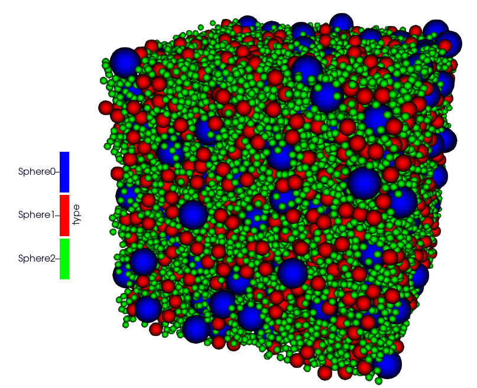
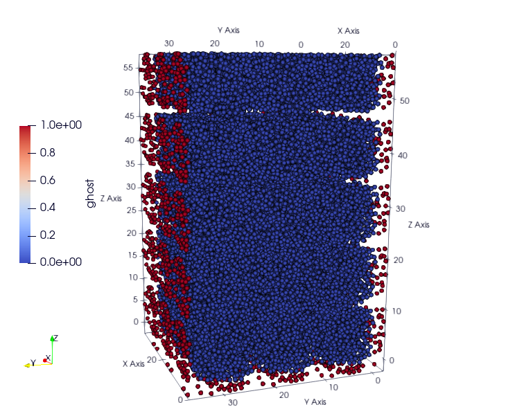
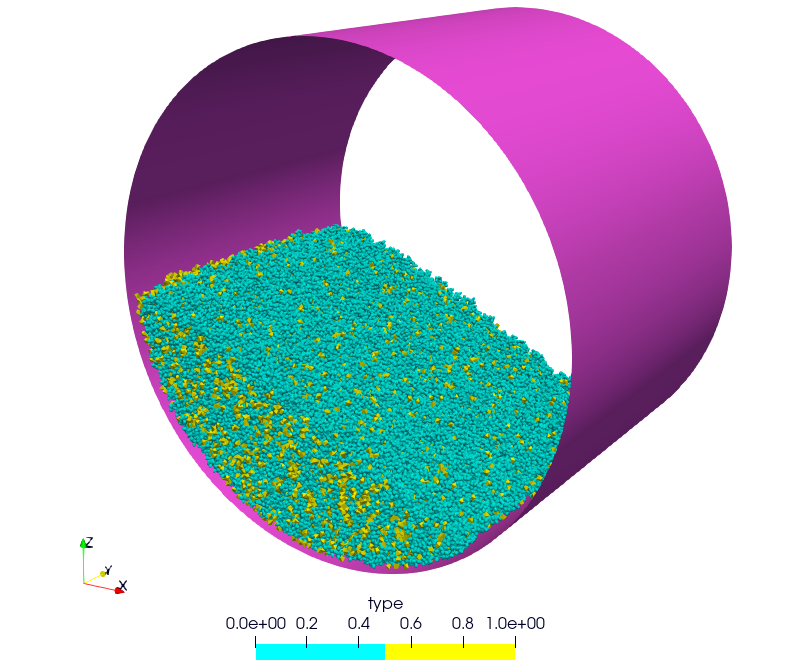
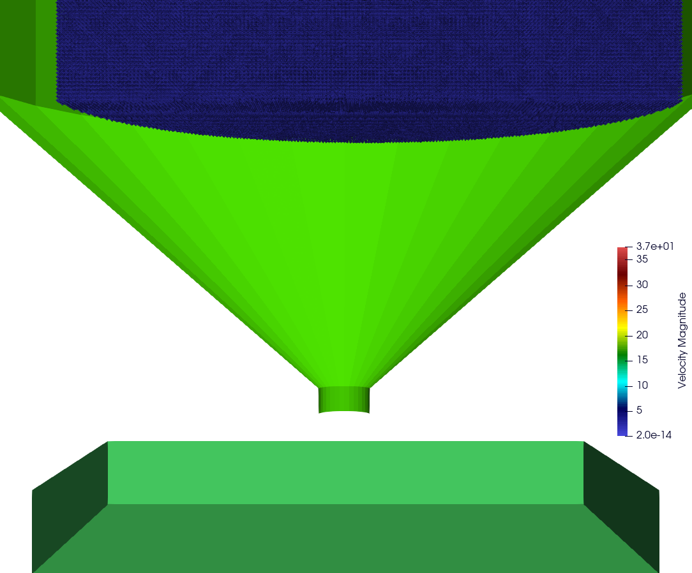

Test cases
==========

You can explore various basic test cases located in the `example` directory. These test cases serve as illustrative examples of ExaDEM's functionality and can assist you in understanding its behavior and capabilities.

If you would like to view your test cases with paraview, here are some instructions:

- For spheres, please use one of this two options:

  - "Point Gaussian" and adjust the radius (one type)
  - Select "Use Scale Array" and select radius as "Gaussian Scale Array" while unselect "Use Scale Transfert Function" and put the field "Gaussian Radius" to 1.

- For polyhedra: 

  - `Paraview For Polyhedra <https://collab4exanbody.github.io/doc_exaDEM/project_exaDEM/user_guide/post_processings.html#dump-paraview-for-polyhedra>`_
  - `Paraview With OBBs <https://collab4exanbody.github.io/doc_exaDEM/project_exaDEM/user_guide/post_processings.html#dump-paraview-with-obbs>`_
  - `Contact Network <https://collab4exanbody.github.io/doc_exaDEM/project_exaDEM//user_guide/post_processings.html#dump-contact-network>`_

- Drivers:

  - Only stl meshes have paraview outputs
  - For cylinder/surface/sphere, use "Sources" -> "Geometric Shapes" -> "Cylinder" / "Plane" / "Sphere"

.. note::

  Some examples can take a long time to run, that's why most of these examples have a "minimal version", mainly used for testing (CI). 

Example Using Spheres
---------------------

All examples with spheres can be found in the directory: ``example/spheres/``.

Example 1: Rotating drum
^^^^^^^^^^^^^^^^^^^^^^^^

A DEM simulation of a set of spheres in a periodic rotating drum. Through this simulation, we can observe how particles interact, collide, and move in response to the drum's motion. This provides insights into phenomena like particle segregation, convection currents, and mixing patterns, contributing to improved understanding of granular material behavior in rotational scenarios. A second scenario without periodic conditions is available, with two rigid surfaces fixed to the end of the drum.  

.. |ex1start| image:: ../_static/rotating_drum_start.png
   :width: 300pt

.. |ex1end| image:: ../_static/rotating_drum_end.png
   :width: 300pt

- Input files:

  - First test case: ``example/spheres/rotating-drum/rotating-drum-periodic.msp``

    - 5,520 spheres
    - 20,000 timesteps
    - 15.4 seconds on 8 cores (OpenMP)

  - Second test case: ``example/spheres/rotating-drum/rotating-no-periodic.msp``

    - 27,000 particles
    - 20,000 timesteps
    - 1 minute and 13 seconds on 8 cores (OpenMP)

  - third test case: ``example/spheres/rotating-drum/rotating-periodic-cohesion.msp``

    - 1,200 particles
    - 30,000 timesteps
    - 8 seconds on 12 cores (OpenMP)

+--------------------------+--------------------------+
| .. centered:: Rotating Drum                         |
+--------------------------+--------------------------+
| .. centered:: Start      | .. centered:: End        |
+==========================+==========================+
| |ex1start|               | |ex1end|                 |
+--------------------------+--------------------------+
| |ex1npstart|             | |ex1npend|               |
+--------------------------+--------------------------+
| |ex1cohesionstart|       | |ex1cohesionend|         |
+--------------------------+--------------------------+

Example 2: Rigid surface
^^^^^^^^^^^^^^^^^^^^^^^^

A DEM simulation involving spherical particles falling onto a rigid surface offers a virtual exploration of particle dynamics in a gravity-driven scenario. This simulation captures the behavior of individual spherical particles as they fall and interact with a solid surface below. 

- Input file: ``example/spheres/rigid-surface/rigid_surface.msp``

  - 7,360 particles
  - 10,000 timesteps
  - 6.6 seconds on 8 cores

.. |ex4end| image:: ../_static/rigid_surface_end.png
   :width: 300pt

+--------------------------+--------------------------+
| .. centered:: Rigid Surface                         |
+--------------------------+--------------------------+
| .. centered:: Start      | .. centered:: End        |
+==========================+==========================+
| |ex4start|               | |ex4end|                 |
+--------------------------+--------------------------+

Example 3: Impose Velocity
^^^^^^^^^^^^^^^^^^^^^^^^^^

In this DEM simulation, a scenario is simulated where a group of particles with imposed velocity occupies a defined area. As other particles fall into this region, they interact with the moving particles, impacting their trajectories. The simulation provides insights into how moving driver particles influence the behavior of surrounding particles. Example: ``impose_velocity_hole``, credit: ``lafourcadp``.  

- Input files:

  - The first test case: ``example/spheres/impose_velocity/impose_velocity_full.msp``

    - 55,200 particles
    - 10,000 timesteps
    - 1 minute and 40 seconds on 8 cores (OpenMP)

  - The second test case: ``example/spheres/impose_velocity/impose_velocity_hole.msp``

    - 2,865 particles
    - 2,000 timesteps
    - 1.3 seconds on 8 cores (OpenMP)

.. |ex5start| image:: ../_static/impose_velocity_start.png
   :width: 300pt

.. |ex5end| image:: ../_static/impose_velocity_end.png
   :width: 300pt

.. |ex5start2| image:: ../_static/ExaDEM/impose_vel_hole_start.png
   :width: 300pt

+--------------------------+--------------------------+
| .. centered:: Impose Velocity                       |
+--------------------------+--------------------------+
| .. centered:: Start      | .. centered:: End        |
+==========================+==========================+
| |ex5start|               | |ex5end|                 |
+--------------------------+--------------------------+
| |ex5start2|              | |ex5end2|                |
+--------------------------+--------------------------+

Example 4: Movable wall
^^^^^^^^^^^^^^^^^^^^^^^

In this DEM simulation, a cluster of spherical particles is compacted against a rigid surface. A piston is introduced to apply a steadily increasing stress that linearly evolves over time. This simulation captures the dynamics as the piston's force gradually grows. As the piston imparts its stress, the particle block undergoes deformation and stress propagation. 

- Input file: ``example/spheres/movable-wall/movable_wall.msp`` 

  - 736 particles
  - 30,000 timesteps
  - 4.1 seconds

.. |ex6start| image:: ../_static/movable_wall_start.png
   :width: 300pt

.. |ex6end| image:: ../_static/movable_wall_end.png
   :width: 300pt

+--------------------------+--------------------------+
| .. centered:: Movable Wall                          |
+--------------------------+--------------------------+
| .. centered:: Start      | .. centered:: End        |
+==========================+==========================+
| |ex6start|               | |ex6end|                 |
+--------------------------+--------------------------+

Example 5: Using an STL Mesh
^^^^^^^^^^^^^^^^^^^^^^^^^^^^

In this DEM simulation, a cluster of spherical particles falls onto an .stl mesh and into a box. This case study highlights the use of meshes containing numerous facets and allows adding all geometries coming from CAD or graphic design. 

- Input file: ``example/spheres/mesh-stl/mesh_stl.msp``

  - 5,000 particles
  - 20,000 timesteps
  - 36.4 seconds on 8 cores (OpenMP)

.. |ex7end| image:: ../_static/mesh_stl_end.png
   :width: 300pt

+--------------------------+--------------------------+
| .. centered:: Mesh STL                              |
+--------------------------+--------------------------+
| .. centered:: Start      | .. centered:: End        |
+==========================+==========================+
| |ex7start|               | |ex7end|                 |
+--------------------------+--------------------------+

Example 6: Particle Generation With RSA Algorithm
^^^^^^^^^^^^^^^^^^^^^^^^^^^^^^^^^^^^^^^^^^^^^^^^^

In this DEM simulation, a cluster of 287,642 spherical particles has been generated by the parallelized `rsa` algorithm :cite:`JOSIEN2024109354`. Then, particles fall by gravity in a drum.

Input file: ``example/spheres/rsa/rsa-full.msp``

A second example, available in ``example/spheres/rsa/rsa_vol_frac.msp``, demonstrates how to define different volume fractions for particles of varying sizes.

.. |ex8start| image:: ../_static/rsa_start.png
   :width: 300pt

.. |ex8end| image:: ../_static/rsa_end.png
   :width: 300pt

.. note::

  ``rsa`` is an optional package, please see installation guildelines to add it.

+--------------------------+--------------------------+
| .. centered:: RSA                                   |
+--------------------------+--------------------------+
| .. centered:: Start      | .. centered:: End        |
+==========================+==========================+
| |ex8start|               | |ex8end|                 |
+--------------------------+--------------------------+
| |ex8bisstart|            | |ex8bisend|              |
+--------------------------+--------------------------+

Example 7: Jet
^^^^^^^^^^^^^^

This example demonstrates the application of a velocity field to spheres based on a Cartesian grid projection. Although it does not represent a physical scenario, a geyser-like effect has been simulated using a cylindrical shape, directing the particle velocities towards a specified speed. Future developments will involve applying non-uniform velocity fields to simulate more complex fluid configurations. Input files are available here: ``example/spheres/jet/step1.msp and step2.msp`` but they don't correspond exactly to the pictures (fewer particles).

.. |ex10starthalf| image:: ../_static/ExaDEM/jet_half_start.png
   :width: 250pt

.. |ex10endhalf| image:: ../_static/ExaDEM/jet_half_end.png
   :width: 250pt

.. |ex10startfull| image:: ../_static/ExaDEM/jet_full_start.png
   :width: 250pt

.. |ex10endfull| image:: ../_static/ExaDEM/jet_full_end.png
   :width: 250pt

+--------------------------+--------------------------+
| .. centered:: Geyser Simulation                     |
+--------------------------+--------------------------+
| .. centered:: Start      | .. centered:: End        |
+==========================+==========================+
| |ex10starthalf|          | |ex10endhalf|            |
+--------------------------+--------------------------+
| |ex10startfull|          | |ex10endfull|            |
+--------------------------+--------------------------+

Example 8: Mirror Boundary Conditions
^^^^^^^^^^^^^^^^^^^^^^^^^^^^^^^^^^^^^

This example tests the mirror conditions available in exaNBody. Although these conditions are not directly applicable (" not physics "), because all fields are copied identically (without processing/filtering) at each time step in the ghost cells (e.g. velocity, moments), except for positions (axial symmetry). This example highlights this functionality and could potentially be coupled with other operators to develop new boundary conditions (e.g. resetting velocities to 0 to model a rigid surface). This example involves dropping 33,120 spheres, adding mirror boundary conditions in all directions, and letting them fall by gravity. 

- Input file: ``example/spheres/mirror/mirror.msp``. 

  - 33,120 particles
  - 5,000 timesteps
  - 21.8 seconds on 8 core (OpenMP)

.. |ex11end| image:: ../_static/ExaDEM/mirror_end.png
   :width: 250pt

+--------------------------+--------------------------+
| .. centered:: Mirror Simulation                     |
+--------------------------+--------------------------+
| .. centered:: Start      | .. centered:: End        |
+==========================+==========================+
| |ex11start|              | |ex11end|                |
+--------------------------+--------------------------+

Examples Using Polyhedra
------------------------

All examples with polyhedra can be found in the directory: ``example/polyhedra/``.

Example 1: Polyhedra Generation Frequency
^^^^^^^^^^^^^^^^^^^^^^^^^^^^^^^^^^^^^^^^^

In this example, we simulate the generation of 100 new polyhedra at every 45000 time steps, representing their descent into a void environment. The primary objective is to illustrate the process of generating a lattice of polyhedra within a confined area. Additionally, we demonstrate the application of a series of operators to initialize various fields associated with the newly generated polyhedra. This example serves as a practical guide for setting up and executing simulations involving dynamic polyhedra generation and manipulation within defined spatial boundaries.

- Input file: ``example/polyhedra/generator/generator.msp``

  - 100 then 200 and 300 Octahedra
  - 10,000 timesteps
  - 9.7 seconds on 8 cores (OpenMP)

.. |ex1pstart| image:: ../_static/generator_start.png
   :width: 250pt

.. |ex1pend| image:: ../_static/generator_end.png
   :width: 250pt

+--------------------------+------------------------------+
| .. centered:: Polyhedra Generation Frequency            |
+--------------------------+------------------------------+
| .. centered:: Start      | .. centered:: End            |
+==========================+==============================+
| |ex1pstart|              | |ex1pend|                    |
+--------------------------+------------------------------+

Example 2: Octahedra in a Rotating Drum
^^^^^^^^^^^^^^^^^^^^^^^^^^^^^^^^^^^^^^^

In this DEM simulation, we observe the dynamics of 125 octahedra as they descend into a rotating drum. The second test case contains 27,000 octahedra (yellow) and 27,000 hexapods (blue).

- Input files:

  - The first example: ``example/polyhedra/rotating_drum/rotating-drum-mini.msp``

    - 125 Octahedra
    - 10,000 timesteps
    - 1 second on 8 core (OpenMP)

  - The second example: ``example/polyhedra/rotating_drum/rotating-drum-mixte.msp``

    - 27,000 Octahedra and 27,000 Hexapods
    - 100,000 timesteps
    - 41 minutes and 36 on 8 cores (OpenMP)
    - 6 minutes and 31 seconds on a100 (100,000 timesteps) with `rcut_inc = 0.4`
    - 11 minutes and 24 seconds on a100 (200,000 timesteps) with `rcut_inc = 0.4` (The stage where the particles fall is costly, as the particles are quickly moved from one cell to another, and the reconstruction of neighbor lists (on the CPU) is also costly.)
    - The pictures corespond to the simulation after 1,000,000 timesteps

  - Other example: ``example/polyhedra/rotating_drum/rotating-drum.msp``

    - 5520 Octahedra
    - 150,000 timesteps
    - 2 minutes and 19 seconds on 8 cores (OpenMP)

  - Other example: ``example/polyhedra/rotating_drum/rotating-drum-mixte-mini.msp``

    - 125 Octahedra and 125 Hexapods
    - 20,000 timesteps
    - 2.5 seconds on 8 cores (OpenMP)

.. |ex2pstart| image:: ../_static/octahedra_rotating_drum_start.png
   :width: 250pt

+--------------------------+--------------------------+
| .. centered:: Polyhedra Generation Frequency        |
+--------------------------+--------------------------+
| .. centered:: Start      | .. centered:: End        |
+==========================+==========================+
| |ex2pstart|              | |ex2pend|                |
+--------------------------+--------------------------+
| |ex2pmixtestart|         | |ex2pmixteend|           |
+--------------------------+--------------------------+

Example 3: Hexapods in a Ball 
^^^^^^^^^^^^^^^^^^^^^^^^^^^^^

This DEM simulation example illustrates the gravitational descent of 64 hexapods within a large sphere. The primary environment consists of a spherical enclosure with a radius of 20 units and is centered at (2, 2, 0). As the hexapods descend under gravity within this enclosure, they encounter two additional spherical obstacles. The first obstacle (ball, represented as a small yellow ball with a radius of 3 units and centered at (2,2,-5). The second ball, centered at (2,2,-20) with a radius of 7 units, depicted as a large orange ball, intersects the surface of the primary blue sphere, adding complexity to the obstacle configuration. Through this simulation, exaDEM shows its capability to manage particle interactions with various obstacles (balls). Additionally, it showcases the versatility of drivers within the code, which can be employed to define both simulation boundary conditions and obstacles.

- Input file: ``example/polyhedra/balls/balls.msp``

  - 64 Hexapods
  - 150,000 timesteps
  - 14.3 seconds on 8 cores (OpenMP)

- Other example: ``example/polyhedra/balls/balls.msp``

  - 64 Hexapods
  - 25,000 timesteps
  - 2.7 seconds on 8 cores (OpenMP)

.. |ex3pstart| image:: ../_static/ExaDEM/polyhedra_ball_start.png
   :width: 250pt

.. |ex3pend| image:: ../_static/ExaDEM/polyhedra_ball_end.png
   :width: 250pt

+--------------------------+--------------------------+
| .. centered:: Hexapods in Ball                      |
+--------------------------+--------------------------+
| .. centered:: Start      | .. centered:: End        |
+==========================+==========================+
| |ex3pstart|              | |ex3pend|                |
+--------------------------+--------------------------+

Example 4: Polyhedra With STL Mesh (Box)
^^^^^^^^^^^^^^^^^^^^^^^^^^^^^^^^^^^^^^^^

This simulation example illustrates the use of STL files with polyhedra. In this simulation, we drop a set of polyhedra (hexapods, octahedra, or both) by gravity into an open box to fill it completely. 

.. |ex4pstarthexa| image:: ../_static/ExaDEM/stl_hexa_start.png
   :width: 250pt

.. |ex4pendhexa| image:: ../_static/ExaDEM/stl_hexa_end.png
   :width: 250pt

.. |ex4pstartocta| image:: ../_static/ExaDEM/stl_octa_start.png
   :width: 250pt

.. |ex4pendocta| image:: ../_static/ExaDEM/stl_octa_end.png
   :width: 250pt

.. |ex4pstartmixte| image:: ../_static/ExaDEM/stl_mixte_start.png
   :width: 250pt

.. |ex4pendmixte| image:: ../_static/ExaDEM/stl_mixte_end.png
   :width: 250pt

- Input files:

  - First example: ``example/polyhedra/stl_mesh/stl_mesh_box_hexapod.msp``

    - 7,344 Hexapods
    - 50,000 timesteps
    - 2 mintes and 19 seconds on 8 cores (OpenMP)

  - Second example:``example/polyhedra/stl_mesh/stl_mesh_box_octahedron.msp``

    - 2,430 Octahedra
    - 50,000 timesteps
    - 1 minute and 6 seconds on 8 cores (OpenMP)

  - Third example: ``example/polyhedra/stl_mesh/stl_mesh_box_mixte.msp``

    - 5760 Octahedra and 5760 Hexapods
    - 100,000 timesteps
    - 8 minutes and 36 seconds on 8 cores (OpenMP)
    - 2 minutes and 34 seconds on a GPU a100 (`rcut_inc = 0.2`, `cell_size = 6`, and `grid_dims = [3,3,10]`) 

.. note::

  These examples have minimal test cases (`_mini.msp`).

+--------------------------+--------------------------+
| .. centered:: Polyhedra With STL Mesh               |
+--------------------------+--------------------------+
| .. centered:: Start      | .. centered:: End        |
+==========================+==========================+
| |ex4pstarthexa|          | |ex4pendhexa|            |
+--------------------------+--------------------------+
| |ex4pstartocta|          | |ex4pendocta|            |
+--------------------------+--------------------------+
| |ex4pstartmixte|         | |ex4pendmixte|           |
+--------------------------+--------------------------+

Example 5: Funnel
^^^^^^^^^^^^^^^^^

This simulation example illustrates the gravitational drop of a set of 1.3 million hexapods into a funnel. The funnel is represented using a mesh of faces (STL mesh).

.. |ex5pendhalf| image:: ../_static/ExaDEM/funnel_half_end.png
   :width: 250pt

.. |ex5pstartfull| image:: ../_static/ExaDEM/funnel_full_start.png
   :width: 250pt

.. |ex5pendfull| image:: ../_static/ExaDEM/funnel_full_end.png
   :width: 250pt

- Input file: ``example/polyhedra/funnel/funnel.msp``

.. note::

  This example is designed to run on a supercomputer or recent GPUs, so don't run it on a laptop.

+--------------------------+--------------------------+
| .. centered:: Polyhedra With a Funnel               |
+--------------------------+--------------------------+
| .. centered:: Start      | .. centered:: End        |
+==========================+==========================+
| |ex5pstarthalf|          | |ex5pendhalf|            |
+--------------------------+--------------------------+
| |ex5pstartfull|          | |ex5pendfull|            |
+--------------------------+--------------------------+

.. _test_case_rescale_shape:

Example 6: Rescale shape 
^^^^^^^^^^^^^^^^^^^^^^^^

In this simulation, two shapes are selected: PolyR and Octahedron. Each shape is then duplicated with its size doubled, resulting in PolyRSize2 and OctahedronSize2. The setup is a rotating drum, where particles are generated using two different methods: FCC and RSA. The simulation runs for 1,000,000 time steps with a time step size of dt = 5e-5.

- Input files:

  - FCC: ``example/polyhedra/rescale_shape/scale_2_shapes_fcc.msp``

    - 2,144 polyhedra or 536 polyhedra of each types
    - 1,000,000 timesteps
    - 1 hour and 23 minutes on 12 cores (OpenMP)

  - RSA: ``example/polyhedra/rescale_shape/scale_2_shapes_rsa.msp``

    - 3,698 polyhedra, the volume fraction used for every types is 0.055
    - 1,000,000 timesteps
    - 38 minutes on 12 cores (OpenMP)

+--------------------------+--------------------------+
| .. centered:: Rescale Shapes                        |
+--------------------------+--------------------------+
| .. centered:: Start      | .. centered:: End        |
+==========================+==========================+
| |ex6pstartfcc|           | |ex6pendfcc|             |
+--------------------------+--------------------------+
| |ex6pstartrsa|           | |ex6pendrsa|             |
+--------------------------+--------------------------+

Example 7: Fragmentation with two fragments 
^^^^^^^^^^^^^^^^^^^^^^^^^^^^^^^^^^^^^^^^^^^

This simulation demonstrates the fragmentation capability. The test case considers a grain composed of two fragments that is rapidly projected onto a rigid surface. Two configurations are compared. In the first one, the grain remains intact because the breakage criterion, governed by the parameter g, is not reached. In the second configuration, a lower value of g leads to the failure of the interface between the two fragments, resulting in fragmentation.

- Input files:

  - With Crakling: ``example/polyhedra/fragmentation/two_fragments_break.msp``

    - 2 fragments
    - 1,800,000 timesteps
    - 84 seconds on 1 core

  - No Crakling: ``example/polyhedra/fragmentation/two_fragments_unbreak.msp``

    - 2 fragments
    - 1,800,000 timesteps
    - 68 seconds on 1 core

.. |ex7pstart| image:: ../_static/two_fragments_start.png
   :width: 250pt

.. |ex7pend| image:: ../_static/two_fragments_end.png
   :width: 250pt

+--------------------------+--------------------------+
| .. centered:: Grain composed of two fragments       |
+--------------------------+--------------------------+
| .. centered:: Start      | .. centered:: End        |
+==========================+==========================+
| |ex7pstart|              | |ex7pend|                |
+--------------------------+--------------------------+

Show-cases
----------

On a laptop or single node
^^^^^^^^^^^^^^^^^^^^^^^^^^

.. _test_case_cylinder_stl: 

Rotating drum simulation
++++++++++++++++++++++++

Simulation of 48,000 spheres on a rotating drum after reading an .stl file. This simulation takes around one hour and 10 minutes on a laptop with 12 cores with OpenMP. The input files are available here: ``example/spheres/cylinder_stl/cylinder_stl.msp``

.. image:: ../_static/cyl_stl.gif
   :align: center

Simulation of 140,000 spheres falling into a cell. A blade is then activated with rotational and translational motion. A This simulation takes around 4-5 days on a single node of 32 cores. A tutorial is available with polyhedra in the tutorial section.

.. image:: ../_static/pale-0.5.gif
   :align: center

TODO: Add input files

On a supercomputer
^^^^^^^^^^^^^^^^^^

Mixer simulation
++++++++++++++++

.. image:: ../_static/mixer_low.gif
   :align: center

Simulation of a mixer into which spherical particles are falling. The simulation consists of rotating a propeller at 0.25 rad/s while using progressively smaller grains. This simulation is based on an example provided in the ``chronoDEM::gpu`` code and described in the following paper: "Chrono::GPU: An open-source simulation package for granular dynamics using the discrete element method" :cite:`fang2021chrono`.
To accelerate simulation time, the time step was increased to 1×10⁻³, and the contact law parameters were adjusted accordingly.

The input files for the different scenarios are available in: `exaDEM/example/spheres/mixer`

- mixer_57k_sph.msp
- mixer_3M_sph.msp
- mixer_29M_sph.msp

Below is an image showing the different scenarios based on the number of particles:

