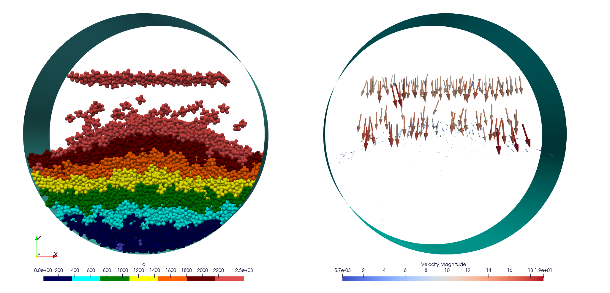
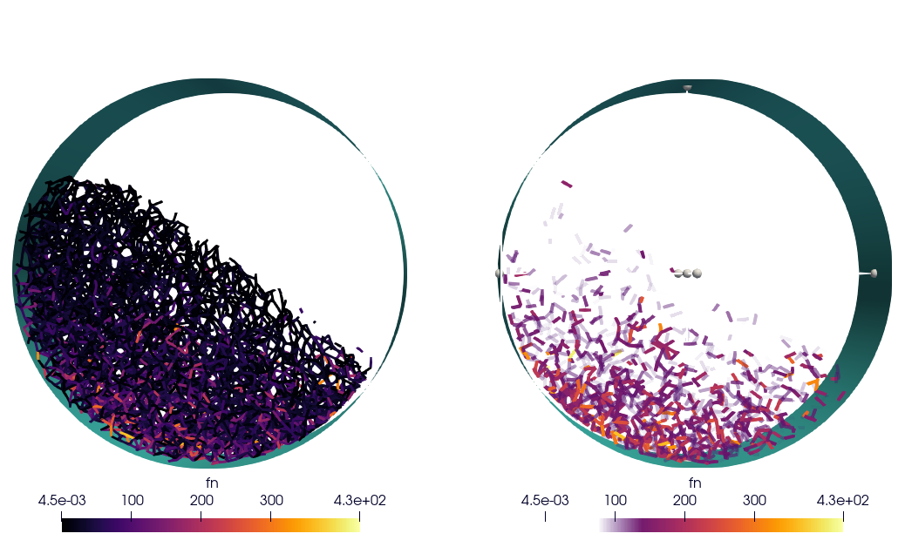
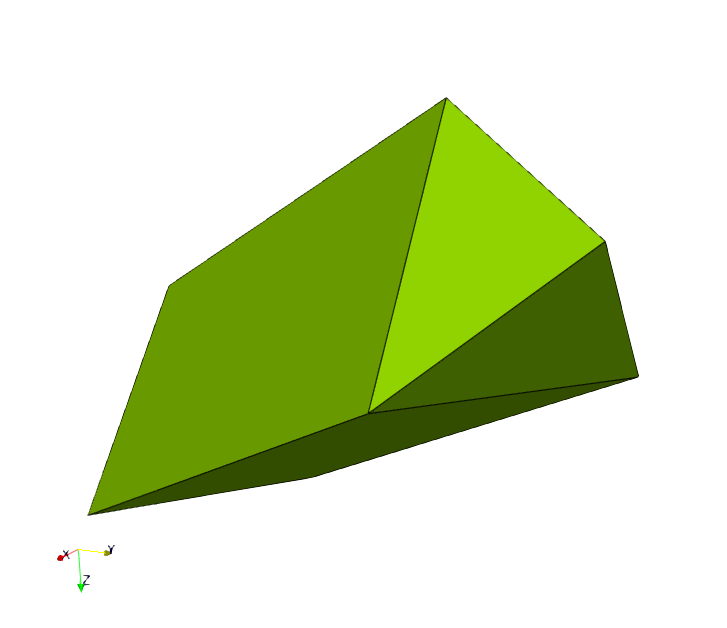

Tutorials
=========

The tutorial files can be found in the ``example/tutorial`` folder.

Polyhedra tutorials
-------------------

Build Your Rotating Drum Simulation With Hexapods And A Particle Generator
^^^^^^^^^^^^^^^^^^^^^^^^^^^^^^^^^^^^^^^^^^^^^^^^^^^^^^^^^^^^^^^^^^^^^^^^^^

.. warning::

  The tutorial does not work correctly with the example files in exaDEM version `1.0.2`. Please go to the master or manually change the AREA of the generator.msp to: ``bounds: [ [ 0 , 0 , 18 ] , [ 20 , 7.5 , 20 ] ]``

In this section, we will outline the steps to generate a set of hexapods in a rotating drum and then initiate the simulation. The simulation will proceed in three steps: 

- The first step involves generating the hexapods within the cylinder. (generator.msp) 
- The second step is to wait for all hexapods to be deposited into the cylinder. (wait.msp)
- Finally, the last step is to execute the simulation by setting the cylinder in motion. (run.msp)

The input files are available in the 'tutorial/hexa-rotating-drum' folder.

The ingredients for generating the hexapods are: 

- defining the polyhedron shape
- setting up the cylinder
- determining the contact force between the polyhedra
- defining a spatial zone for particle generation
- specifying an appearance frequency
- initializing the generated polyhedra

The chosen shape file is a hexapod in the input file, as follows:

.. code-block:: bash

 <
 name alpha3
 radius 0.237770037899799
 preCompDone y
 nv 6
 0.475540075799599 0 0
 -0.475540075799599 0 0
 0 0.475540075799599 0
 0 -0.475540075799599 0
 0 0 0.475540075799599
 0 0 -0.475540075799599
 ne 3
 0 1
 2 3
 4 5
 nf 0
 obb.extent 0.713310113699398 0.713310113699398 0.713310113699398
 obb.e1 1 0 0
 obb.e2 0 1 0
 obb.e3 0 0 1
 obb.center 0 0 0
 volume 0.523598775598299
 I/m 0.13266 0.13266 0.13266
 >

We add a paraview polydata created for this shape (exaDEM doesn't display correctly without face as hexapods, otherwise, during the init step, a `your_shape`.vtk is written).

.. image:: ../_static/ExaDEM/tuto_alpha3.png
   :width: 300pt

For this simulation, we choose to fill an infinite cylinder centered at (10,3.75,10) with a radius of 16. This detection is added during the construction of neighbor lists (`nbh_polyhedron` operator).

.. code-block:: yaml

  setup_drivers:
    - register_cylinder:
       id: 0
       state: {center: [10, 3.75, 10], axis: [1, 0, 1], radius: 16}
       params: { motion_type: STATIONARY }

.. note::
	`setup_drivers` is a default operator integrated in the default execution graph of exaDEM. By default, this operator is set to nop for `no operator`.

We use the contact's law to compute contact force between the polyhedra/polyhedra and cylinder/polyhedra. Gravity is applied everywhere.

.. code-block:: yaml

 compute_force:
   - gravity_force
   - contact_polyhedron:
      symetric: true
      config: { rcut: 0.0 m , dncut: 0.0 m, kn: 10000, kt: 10000, kr: 0.0, fc: 0.0, mu: 0.1, damp_rate: 0.999}
      config_driver: { rcut: 0.0 m , dncut: 0.0 m, kn: 10000, kt: 10000, kr: 0.0, fc: 0.0, mu: 0.1, damp_rate: 0.999} 

Now, we need to define a spatial zone for particle generation, this zone is the box defined by the inf point = (0,0,19) and sup point (20,7.5,20).

.. code-block:: yaml

 particle_regions:
    - AREA:
       bounds: [ [ 0 , 0 , 18 ] , [ 20 , 7.5 , 20 ] ]

And we design the domain such as the region AREA is included:

 
.. code-block:: yaml

  domain:
    cell_size: 1.5 m
    periodic: [false,true,false]
    grid_dims: [14, 5, 14]
    bounds: [[0 m ,0 m, 0 m], [21 m, 7.5 m, 21 m]]
    expandable: true

Now we add a first lattice generator operator to initialize the simulation. 

.. code-block:: yaml

 add_particles:
    - lattice:
       structure: SC
       types: [ 0 ]
       size: [ 1.5 , 1.5 , 1.5 ]
       region: AREA

Then we need to initialize hexapods in this region (AREA). The default density is `1`, the volume information used to compute the mass is stored in the shape. 

.. code-block:: yaml

 init_new_particles:
   - density_from_shape
   - set_rand_velocity: 
      region: AREA
      var: 0.1
      mean: [0.0,0.0,-10.0]
   - inertia_from_shape
   - set_quaternion:
      region: AREA
   - radius_from_shape:
      region: AREA

Now, we can define our `input_data` operator:

.. code-block:: yaml

 input_data:
   - read_shape_file:
      filename: alpha3.shp
   - add_particles
   - init_new_particles

The following block consists of the overload of the `add_generated_particles` operator that is set to `nop` by default. Note that this operator is triggered by the frequency `simulation_generator_frequency: 40000` defined in the global operator, default is `-1`.

.. code-block:: yaml

 add_generated_particles:
   - add_particles
   - init_new_particles

Step one is the `generator.msp` file. To run the simulation, use the following command.

.. code-block:: console

	mpirun -n 2 ./exaDEM generator.msp --omp-num-threads 2

.. note::
  Make sure that the alpha3.shp file is in the same location as the simulation.

Picture at the middle of the first step:

.. image:: ../_static/ExaDEM/step1-mid.png
   :width: 600pt

Picture at the end of the first step:

The step 2 consists of waiting for the deposit to be finished from timestep 1,200,000 (12s) to 1,400,000 (14s). 

First, load the snapshot at time step 1,200,000 and disable generation. It's important not to forget to define the cutoff radius for the hexapods used with the operator `polyhedra_define_radius` for building the Verlet lists.

.. code-block:: yaml

 input_data:
   - read_shape_file:
      filename: alpha3.shp
   - read_dump_particle_interaction:
      filename: ExaDEMOutputDir/CheckpointFiles/exaDEM_001200000.dump
   - radius_from_shape

Disable the hexapod generator:

.. code-block:: yaml

 simulation_generator_frequency: -1

Step two corresponds to the `wait.msp` file. To run this simulation, use the following command.

.. code-block:: console

	mpirun -n 2 ./exaDEM wait.msp --omp-num-threads 2

Picture at the end of the second step, the deposit is stable (i.e. no velocity):

.. image:: ../_static/ExaDEM/step2-end.png
   :width: 600pt

Step 3 consists og running the rotating drum simulation from timestep 1,400,000 (14s) to 5,000,000 (50s). 

Initiate motion of your drum. You can determine the angular velocity using the Froude number and deduce the angular velocity from it. Fr = w^2 * R / g or w = sqrt(Fr * g / R). In our case, we desire a cascading behavior with a Froude number of 0.2, w = sqrt( 0.2 * 9.81 / 16 ) = 0.350178526 ~= 0.35 rad.s-1. 

.. code-block:: yaml

      vrot: [0,0.35,0]

In addition, we display the contact network (normal force) between the hexapods.

.. code-block:: yaml

  global:
    enable_contact_network: true

Step three corresponds to the `run.msp` file. To run this simulation, use the following command.

.. code-block:: console

	mpirun -n 2 ./exaDEM run.msp --omp-num-threads 2

This is the final contact network at 50s.

Picture at the end of the third step:

.. image:: ../_static/ExaDEM/step3-end.png
   :width: 600pt

Tutorial: Blade simulation
^^^^^^^^^^^^^^^^^^^^^^^^^^

The aim of this tutorial is to set up a simulation of a descending blade in a silo. 

.. image:: ../_static/blade.gif

As in the previous example, this simulation is carried out in 3 stages, corresponding to 3 msp files:  

- Particle generation [generator.msp]
- Waiting for the deposit to stabilize [wait.msp]
- Adding the blade and setting it in motion [run.msp]

The files are available in the exaDEM/tutorial/blade folder. The STL files are available in the following git: https://github.com/Collab4exaNBody/exaDEM-Data.git . 
Note that msp files are set to fetch STL/SHP files directly from the exaDEM-Data folder if it has been copied to your blade repository.

Step 1 consists of generating particles in a cylinder whose main axis is Oz and with a base to stop it. To do this, add them to the list of drivers by defining the `setup_drivers` operator.

.. code-block:: yaml

  setup_drivers:
    - add_stl_mesh:
       id: 0
       filename: exaDEM-Data/stl_files/mod_base.shp
       center: [0,0,-20] 
       minskowski: 0.01
    - register_cylinder:
       id: 1
       state: {radius: 25, center: [0,0,0], axis: [1,1,0]}
       params: { motion_type: STATIONARY }

With mod_base, a large shape in the image is just below: 

The type of polyhedral particle used for this simulation is as follows (defined into shape.shp): 

To add it, define it in the `input_data` operator. We also add particles using the `lattice` operator:

.. code-block:: yaml

  input_data:
    - read_shape_file:
       filename: shape.shp
    - init_rcb_grid
    - lattice:
        structure: SC
        types: [ 0 ]
        size: [ 4.0 m , 4.0 m , 4.0 m ]
        region: CYL1 and BOX 
    - init_fields:

In simulations with exaDEM, you need to define a simulation domain, which can be expanded later if necessary if you specify expandable: true and the boundary condition is not periodic. It is very important that cell size, grid dimensions, and simulation box are consistent.

.. code-block:: yaml

  domain:
    cell_size: 5.0 m
    periodic: [false,false,false]
    grid_dims: [10, 10, 8]
    bounds: [[-25 m , -25 m, 0 m], [25 m, 25 m, 40 m]]
    expandable: true

For this example, we have decided to define a zone/area that fits the shape of the cylinder to generate the particles. To do this, we need to define the different regions: 

.. code-block:: yaml

  particle_regions:
    - CYL1:
        quadric:
          shape: cylz
          transform:
            - scale: [ 23 m, 23 m, 5 m]
            - translate: [ 0 m , 0 m, 50 m ]
    - BOX:
        bounds: [ [ -25 , -25 , 35 m ] , [ 25 m , 25 m, 40 m] ]

To generate new polyhedra every 25,000 time steps, you need to define two points: the generation frequency and the operator that will create and initialize the particle. The frequency must be specified in the global operator:  

.. code-block:: yaml

  global:
    simulation_generator_frequency: 25000

For the particle generation, operators must be grouped together in the `add_generated_particles` operator call: 

.. code-block:: yaml

  init_fields:
    - radius_from_shape
    - set_density:
       density: 0.0026
       region: CYL1 and BOX 
    - set_rand_velocity:
       var: 0.0001
       mean: [0.0,0.0,-0.5]
       region: CYL1 and BOX 
    - set_rand_vrot_arot:
       region: CYL1 and BOX 
    - set_quaternion:
       random: true
       region: CYL1 and BOX 
    - update_inertia:
       region: CYL1 and BOX 

  add_generated_particles:
    - lattice:
        structure: SC
        types: [ 0 ]
        size: [ 4.0 m , 4.0 m , 4.0 m ]
        region: CYL1 and BOX 
    - init_fields

Next, define the parameters of the contact law and add gravity for gravity deposition. To achieve this, they must be defined in the compute_force operator:

.. code-block:: yaml

  compute_force:
    - gravity_force:
       gravity: [0,0,-0.00981]
   - contact_polyhedron:
       symetric: true
       config: { rcut: 0.0 m , dncut: 0.0 m, kn: 1.257, kt: 1.077, kr: 0.0, fc: 0.0, mu: 0.0, damp_rate: 0.999}
       config_driver: { rcut: 0.0 m , dncut: 0.0 m, kn: 12.57, kt: 10.77, kr: 0.0, fc: 0.0, mu: 0.0, damp_rate: 0.999}

.. note:: 

  During deposition, friction is set to 0. It will be changed when the blade is set in motion in step 3. 

Finally, we now define the general parameters of the simulation, i.e. the time step value (dt), the number of time steps, the Verlet radius (rcut_inc), and the frequencies of the stop/restart and Paraview outputs.

.. code-block:: yaml

  global:
    simulation_dump_frequency: 100000
    simulation_end_iteration: 1400000 
    simulation_log_frequency: 1000
    simulation_paraview_frequency: 5000
    simulation_load_balance_frequency: -1 #27000
    dt: 0.0005 s
    rcut_inc: 0.5 m
    enable_stl_mesh: true
    simulation_generator_frequency: 25000

.. note::

  For the sake of performance, it's important to understand that a larger Verlet radius means less frequent updating of interaction lists but more frequent updating of interaction lists. It's very important to find a good trade-off between these two factors.

Step one is the `generator.msp` file. To run the simulation, use the following command.

.. code-block:: console

 ./exaDEM generator.msp --omp-num-threads 12

After 1,400,000 time steps, you should reach the following configuration. To complete the deposit, you'll need to wait a while for the deposit to stabilize (step2).

Step 2, in this step, we restart the simulation where we stopped it while disabling the polyhedron generator. To do this, load all stored elements (drivers, shapes, and particles) into the ExaDEMOutputDIR/CheckpointFiles/ folder. For drivers, you can simply include the `.msp` files created for this purpose. For particles, you need to specify in the input_data operator the shape file created and the file containing the particle data and active interactions.

.. code-block:: yaml

  includes:
    - config_polyhedra.msp
    - ExaDEMOutputDir/CheckpointFiles/driver_0001400000.msp

  input_data:
    - read_shape_file:
       filename: ExaDEMOutputDir/CheckpointFiles/RestartShapeFile.shp
    - read_dump_particle_interaction:
       filename: ExaDEMOutputDir/CheckpointFiles/exadem_0001400000.dump
    - radius_from_shape

.. warning:: 

  You have to call radius_from_shape otherwise, the interactions won't be defined.

After 100,000 time steps [t = 1,500,000 time steps], you should reach the following configuration:

Step 3, 

Developers Tutorials
--------------------

Add Your Own mutator_field Operator
^^^^^^^^^^^^^^^^^^^^^^^^^^^^^^^^^^^

This is a minimal example to add your own mutator_field operator:

- [1] Set class name: `SetYourFields`
- [2] Set fields: `field::_YOUR_FIELD_1, field::_YOUR_FIELD_2, ..., field::_YOUR_FIELD_N`
- [3] Set types: `YOUR_TYPE_1, YOUR_TYPE_Z, ... , YOUR_TYPE_N`
- [4] Set field slots: `your_field_1, your_field_2, ..., your_field_N` 
- [5] Set operator name: `set_your_fields`
- [6] Specify template: `SetYourFields`

.. code-block:: cpp

 #include <exaDEM/set_fields.h>
 namespace exaDEM
 {
    using namespace exanb;
    template<typename GridT
      , class = AssertGridHasFields< GridT, field::_YOUR_FIELD_1, field::_YOUR_FIELD_2, ..., field::_YOUR_FIELD_N>
      >
    class SetYourFields : public OperatorNode
    {
      static constexpr YOUR_TYPE_1 default_field_value_1 = YOUR_TYPE_1();
          static constexpr YOUR_TYPE_2 default_field_value_2 = YOUR_TYPE_2();
      ...
      static constexpr YOUR_TYPE_N default_field_value_N = YOUR_TYPE_N();
      using ComputeFields = FieldSet< field::_YOUR_FIELD_1, field::_YOUR_FIELD_2, ..., field::_YOUR_FIELD_N>;
      static constexpr ComputeFields compute_field_set {};

      ADD_SLOT( GridT, grid , INPUT_OUTPUT );
      ADD_SLOT( YOUR_TYPE_1, your_field_1, INPUT, default_radius, DocString{"default  value for all particles"} );
      ADD_SLOT( YOUR_TYPE_2, your_field_2, INPUT, default_radius, DocString{"default value for all particles"} );
      ...
      ADD_SLOT( YOUR_TYPE_N, your_field_N, INPUT, default_radius, DocString{"default value for all particles"} );

      public:

      inline std::string documentation() const override final
      {
        return R"EOF(
                  This operator sets the ... value(s) for every particles.
                )EOF";
      }

      inline void execute () override final
      {
        SetFunctor<YOUR_TYPE_1,YOUR_TYPE_2, ... , YOUR_TYPE_N> func = { 
         {*your_field_1}, 
         {*your_field_2},
         ... , 
         {*your_field_N} 
       };
        compute_cell_particles( 
          *grid , false , func , 
          compute_field_set , 
          gpu_execution_context() , 
          gpu_time_account_func() 
        );
      }
    };
    template<class GridT> using SetYourFieldsTmpl = SetYourFields<GridT>;
    // === register factories ===  
    CONSTRUCTOR_FUNCTION
    {
      OperatorNodeFactory::instance()->register_factory( "set_your_fields", make_grid_variant_operator< SetYourFieldsTmpl > );
    }
  }
