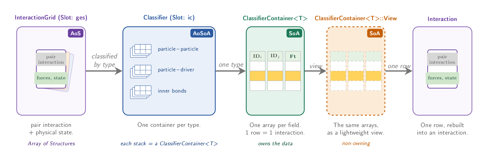
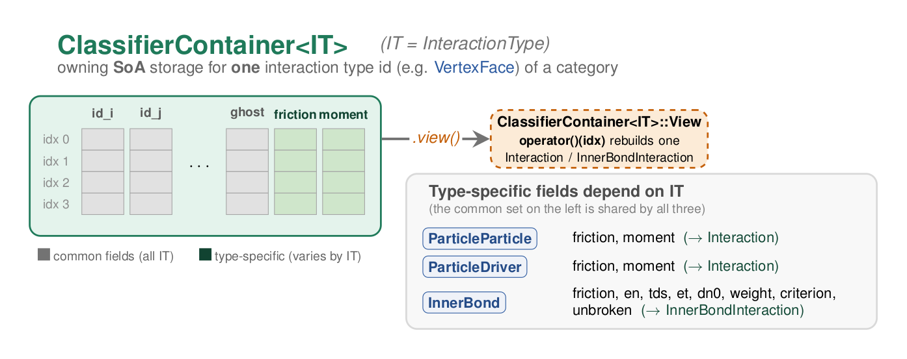
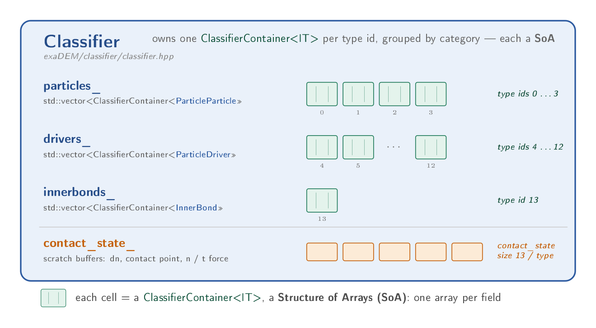
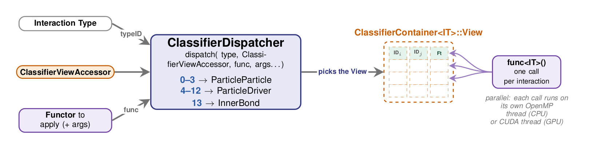

.. _exadem_views_interactions_classifier:

Views, Interactions & Classifier
==================================

``exaDEM`` stores most of its bulk per-element data (interactions, driver projection grids,
polyhedron position backups, GPU neighbor-list bookkeeping, ...) as owning
Structure-of-Arrays containers, and exposes it to compute kernels through a lightweight,
non-owning ``View`` built on top of ``onika::cuda::span``. This page has three parts:

- :ref:`exadem_views` -- what a ``View`` is, as a general pattern used across the codebase.
- :ref:`exadem_interactions` -- the per-interaction structs (``InteractionPair``,
  ``Interaction``, ``InnerBondInteraction``, ``PlaceholderInteraction``), and how to add a
  field to one.
- :ref:`exadem_classifier` -- ``Classifier``, ``ClassifierContainer`` and
  ``ClassifierDispatcher``, the storage and dispatch machinery built on top of both.

   How the classes on this page relate to each other, left to right: individual interactions
   (Array-of-Structs) are grouped by type into a ``Classifier`` -- itself an array of per-type
   containers, i.e. an Array-of-Structures-of-Arrays; each type is one ``ClassifierContainer<T>``
   (an owning Structure-of-Arrays); a ``View`` exposes the same arrays without owning them; and a
   single row of a ``View``, once indexed, is rebuilt back into one ``Interaction`` (or
   ``InnerBondInteraction``).

.. _exadem_views:

Views
-----

What is a ``View``
~~~~~~~~~~~~~~~~~~~

``View`` is not a single class but a convention (in exaDEM) followed by several, otherwise unrelated,
owning storage classes across the codebase. A class following it declares a nested ``struct
View`` and a ``.view()`` method:

- the owning class stores its data in ``CudaMMVector<T>`` (one per field, for
  Structure-of-Arrays layouts) or another owning container,
- its nested ``View`` mirrors the same fields, but each one is an ``onika::cuda::span<T>`` --
  a non-owning ``{ T* data; size_t size; }`` pair pointing at the same (CUDA unified) memory,
- ``.view()`` builds a ``View`` from the current state of the owning object.

A ``View`` is trivially copyable and safe to capture by value into a ``parallel_for``/GPU
kernel functor, unlike the owning object itself. This is the recurring reason the pattern
exists: build the owning storage on the host (resize, fill, ...), then hand a cheap,
GPU-callable ``View`` of it to the kernel.

.. list-table:: Some ``View``s in ``exaDEM``
   :widths: 40 40
   :header-rows: 1

   * - Owning class
     - ``View``
   * - ``ClassifierContainer<IT>``
     - ``ClassifierContainer<IT>::View``
   * - ``DEMBackupData``
     - ``DEMBackupData::View``
   * - ``RShapeDriverGridCellIndexes``
     - ``RShapeDriverGridCellIndexes::View``
   * - ``CellStorage`` / ``CellPairStorage``
     - ``CellStorage::View`` / ``CellPairStorage::View``
   * - ``InteractionHistory``
     - ``InteractionHistory::View``
   * - ``IgnorePairsGPU``
     - ``IgnorePairsGPU::View``

Usage example
~~~~~~~~~~~~~

The simplest instance of the pattern, ``DEMBackupData`` (``polyhedron/backup_dem.hpp``):

.. code-block:: cpp

   struct DEMBackupData {
     onika::memory::CudaMMVector<double> data_;
     onika::memory::CudaMMVector<uint32_t> index_map_;

     struct View {
       onika::cuda::span<double> data_;
       onika::cuda::span<uint32_t> index_map_;
     };

     inline View view() { return View{onika::cuda::make_span(data_), onika::cuda::make_span(index_map_)}; }
   };

and how it is consumed: build a ``View`` from the owning object, then read/write a field
directly through it, exactly like on the owning ``CudaMMVector`` (``operator[]``/``.data()``),
just without owning the memory:

.. code-block:: cpp

   int idx = 50;
   int shift = 10;
   DEMBackupData::View view = backup_dem.view();
   view.index_map_[idx] = shift; 
   double value = view.data_[view.index_map_[idx]];

.. note:: ``View`` and performance: spans are not ``restrict`` pointers

.. _exadem_interactions:

Interactions
------------

Independently of how they are stored (see :ref:`exadem_views` / :ref:`exadem_classifier`),
interactions come in a small family of C++ structs (``exaDEM/interaction/``) -- the leftmost and
rightmost boxes of the diagram above. Every one of them starts with an ``InteractionPair pair_``,
which holds the *topology* of the interaction (who is interacting with whom) and is identical
regardless of the kind of interaction; what follows ``pair_`` holds the
kind-specific *physical state* and differs between a contact and an inner bond.

.. list-table:: Elements of each interaction struct
   :widths: 25 75
   :header-rows: 1

   * - Struct
     - Content
   * - ``InteractionPair``
     - Topology only, common to every kind: ``pi_``, ``pj_`` (each a ``ParticleSubLocation``:
       ``id_``, ``cell_``, ``p_``, ``sub_``), ``type_``, ``swap_``, ``ghost_``
   * - ``Interaction``
     - ``pair_`` + ``friction`` (``Vec3d``), ``moment`` (``Vec3d``)
   * - ``InnerBondInteraction``
     - ``pair_`` + ``friction`` (shared tag with ``Interaction``), ``en``, ``tds``, ``et``,
       ``dn0``, ``weight``, ``criterion`` (``RuptureCriteria``), ``unbroken``
   * - ``PlaceholderInteraction``
     - ``pair_`` + an opaque, fixed-size byte buffer, big enough to hold whichever of
       ``Interaction``/``InnerBondInteraction`` is larger

The kind-specific fields (listed in the table above, e.g. ``friction`` on ``Interaction``) are
not plain public members: they are read/written through ``operator[]`` with a tag from the
``attr`` namespace, ``I[attr::NAME]``, on any ``Interaction``/``InnerBondInteraction`` instance
-- for example:

.. code-block:: cpp

   Vec3d f = I[attr::friction];
   I[attr::moment] = Vec3d{0, 0, 0};

The same ``operator`` also works on a whole ``ClassifierContainer<IT>`` or its
``View`` (returning the field's array instead of a single value) -- see :ref:`exadem_classifier`.

``PlaceholderInteraction`` is the *type-erased* form used whenever code needs to hold/move/sort
an interaction without knowing at compile time whether it's a contact or an inner bond: its
buffer is reinterpreted as the real struct via ``.as<T>()`` once the kind is known (from
``pair_.type_``).

.. warning::

   Because dump/restart files store ``PlaceholderInteraction`` as raw bytes, adding, removing,
   or reordering fields in ``Interaction``/``InnerBondInteraction`` changes its in-memory layout
   and therefore **breaks binary compatibility with previously-written dump files** containing
   interactions.).

Adding an attribute in an interaction struct
~~~~~~~~~~~~~~~~~~~~~~~~~~~~~~~~~~~~~~~~~~~~

``Interaction``, ``InnerBondInteraction``, ``ClassifierContainer<IT>`` and
``ClassifierContainer<IT>::View`` do **not** declare their fields directly: each is generated
from an X-macro field list via the machinery in ``interaction_decoration.hpp`` (see the large
"DANGER ZONE" comment at the top of that file for the full set of caveats). In practice, adding
a field to an interaction just means adding one line to one of two lists:

- ``EXADEM_INTERACTION_FIELDS``, in ``src/interaction/include/exaDEM/interaction/interaction.hpp``
  -- backs ``Interaction`` (particle-particle and particle-driver contacts).
- ``EXADEM_INNER_BOND_FIELDS``, in
  ``src/interaction/include/exaDEM/interaction/inner_bond_interaction.hpp`` -- backs
  ``InnerBondInteraction`` (see the worked example below).

.. code-block:: cpp

   #define EXADEM_INTERACTION_FIELDS(X)    \
     X(exanb::Vec3d, friction, 0, NEW_TAG) \
     X(exanb::Vec3d, moment, 1, NEW_TAG)

Append a new line ``X(TYPE, NAME, INDEX, NEW_TAG)``, with ``INDEX`` equal to the list's current
length (``2`` here, since it would become the third field). That's it: the ``attr::NAME`` tag,
the ``operator`` accessor, and the matching storage in ``ClassifierContainer<IT>``
and its ``View`` are all generated automatically from that one line -- nothing else needs a
manual edit.

Use ``NEW_TAG`` unless the field already exists in the *other* list under the same name (like
``friction``, used by both ``Interaction`` and ``InnerBondInteraction``): in that case, write
``SHARED_TAG`` instead, so the name isn't declared twice.

.. danger::

   ``INDEX`` must match the field's position in the list (``0, 1, 2, ...``). Nothing checks this
   at compile time -- a wrong index silently reads/writes the wrong field at runtime.

Tutorial: adding a field to ``InnerBondInteraction``
~~~~~~~~~~~~~~~~~~~~~~~~~~~~~~~~~~~~~~~~~~~~~~~~~~~~~~

Worked example applying the recipe above: add ``dissipated_energy`` (a ``double`` accumulating
the energy dissipated by a bond over time) to inner-bond interactions.

1. **Edit the field list**, in ``exaDEM/interaction/inner_bond_interaction.hpp`` -- append a
   line with ``INDEX = 8`` (the list currently has 8 entries, indices ``0``..``7``):

   .. code-block:: cpp

      #define EXADEM_INNER_BOND_FIELDS(X)         \
        X(exanb::Vec3d, friction, 0, SHARED_TAG)  \
        X(double, en, 1, NEW_TAG)                 \
        X(exanb::Vec3d, tds, 2, NEW_TAG)          \
        X(double, et, 3, NEW_TAG)                 \
        X(double, dn0, 4, NEW_TAG)                \
        X(double, weight, 5, NEW_TAG)             \
        X(RuptureCriteria, criterion, 6, NEW_TAG) \
        X(uint8_t, unbroken, 7, NEW_TAG)          \
        X(double, dissipated_energy, 8, NEW_TAG)  // <-- new field, NEW_TAG since it's not reused elsewhere

2. **Extend the explicit initializer list** on ``InnerBondInteraction`` (same file) with a
   default value at the matching position -- unlike ``Interaction``, which just zero-initializes
   everything, this struct lists a default value for every field by hand.

   .. code-block:: cpp

      fm_ = {
          {0, 0, 0},  // friction
          0.0,        // en
          {0, 0, 0},  // tds
          0.0,        // et
          0.0,        // dn0
          1.0,        // weight
          {},         // criterion
          true,       // unbroken
          0.0         // dissipated_energy
      };

3. **Use the field.** It is already usable through ``operator`` on
   ``InnerBondInteraction``, on ``ClassifierContainer<InnerBond>`` and on its ``View`` -- no
   further declaration needed. For instance, accumulating it in a fracture-criterion-style
   kernel (pattern taken from ``apply_interface_fracture_criterion.hpp``, which already reads
   ``interaction_[attr::en]``/``interaction_[attr::et]`` the same way):

   .. code-block:: cpp

      // per-interaction update, e.g. inside a kernel operating on an InnerBondInteraction& I
      I[attr::dissipated_energy] += I[attr::en] + I[attr::et];

      // or, batched over a whole View (as apply_interface_fracture_criterion.hpp does for en/et):
      double* __restrict__ diss = interactions_[attr::dissipated_energy].data();
      diss[idx] += en[idx] + et[idx];

.. danger:: This will very likely break reading previously-written restart/dump files

.. _exadem_classifier:

Classifier, ClassifierContainer & ClassifierDispatcher
--------------------------------------------------------

``exaDEM`` stores every interaction (particle-particle contact, particle-driver contact, or
inner bond) as a row of a per-type Structure-of-Arrays container -- the three middle boxes of
the diagram above: one ``ClassifierContainer<IT>`` per interaction type id, owned by a
``Classifier``, exposed to kernels through ``ClassifierContainer<IT>::View`` (an instance of the
``View`` pattern described above), and routed to the right compile-time ``InteractionType`` at
runtime by ``ClassifierDispatcher``. Its fields are the same ones described in
:ref:`exadem_interactions` above -- see that section for how to add one.

ClassifierContainer
~~~~~~~~~~~~~~~~~~~

The ``ClassifierContainer<IT>`` class is the owning
storage for **one interaction type id** (e.g. ``VertexFace``) of a given ``InteractionType``
category (``IT``). It is explicitly specialized per ``InteractionType`` because each category backs a
different per-interaction struct and therefore a different field set:

   The common fields (grey) are shared by all three specializations; the type-specific fields
   (green) depend on ``IT`` -- ``friction``/``moment`` for ``ParticleParticle``/``ParticleDriver``
   (backing ``Interaction``), or the larger inner-bond field set for ``InnerBond`` (backing
   ``InnerBondInteraction``).

.. list-table:: ``ClassifierContainer<IT>`` fields, by ``InteractionType`` (``IT``)
   :widths: 20 30 50
   :header-rows: 1

   * - ``IT``
     - Common fields (all specializations)
     - Type-specific fields
   * - ``ParticleParticle``
     - ``id_i``, ``id_j``, ``cell_i``, ``cell_j``, ``p_i``, ``p_j``, ``sub_i``, ``sub_j``,
       ``swap``, ``ghost``
     - ``friction``, ``moment``
   * - ``ParticleDriver``
     - *(same as above)*
     - ``friction``, ``moment``
   * - ``InnerBond``
     - *(same as above)*
     - ``friction``, ``en``, ``tds``, ``et``, ``dn0``, ``weight``, ``criterion``, ``unbroken``

Each field is accessed as one array via ``container[attr::field_name]``. To build a container,
``resize``/``clear`` it and fill it with ``insert``/``copy`` from a
``std::vector<PlaceholderInteraction>``; to consume it in a kernel, call ``view()`` to get a
``ClassifierContainer<IT>::View`` (see :ref:`exadem_views`).

Classifier
~~~~~~~~~~

``Classifier`` owns one ``ClassifierContainer<IT>`` per interaction type id, grouped into three ``std::vector``s by category + one buffer for contact-law ``scratch`` data:

- ``particles_``: type ids 0...3, one per polyhedron feature pair: vertex-vertex, vertex-edge, vertex-face, edge-edge, ``std::vector<ClassifierContainer<ParticleParticle>>``.
- ``drivers_``: type ids 4...12, one per particle/driver feature pair,  ``std::vector<ClassifierContainer<ParticleDriver>>``.
- ``innerbonds_``, type id 13, ``std::vector<ClassifierContainer<InnerBond>>``.
- ``contact_state_``: per-type scratch buffers for quantities computed by the contact law but
  not persisted on the interaction itself (overlap ``dn``, contact point, normal/tangential
  force).

Given a runtime type id (0... NTypes-1), ``get_data<IT>(typeID)`` /
``get_info<IT>(typeID)`` return the matching ``ClassifierContainer<IT>&`` (and its size for the
latter); ``IT``, for ``InteractionType``, must be known at compile time and is usually fixed by the calling template.
``for_all_interactions(classifier, func, ...)`` loops over
every type id and calls ``func`` once per non-empty container.

ClassifierDispatcher
~~~~~~~~~~~~~~~~~~~~

Motivation: there is a mismatch to resolve here. Compute kernels are templated on the compile-time
``InteractionType IT`` -- the compiler needs to know, at compile time, whether it's generating
code for ``Interaction`` or ``InnerBondInteraction`` (and their respective ``View``). But at
runtime, all the code actually has is a plain integer type id, read off the particle's neighbor
list -- not a C++ type.

   ``ClassifierDispatcher::dispatch`` turns a runtime type id back into the matching
   ``ClassifierContainer<IT>::View``, and calls ``func<IT>()`` once per interaction of that type
   -- in parallel, each call running on its own OpenMP thread (CPU) or CUDA thread (GPU).

The ``ClassifierDispatcher`` (aliased ``IDispatcher`` for the 3 real categories) closes that gap, as shown above: given the runtime
type id, it works out which of ``Types...`` it belongs to and calls
``func.template operator()<IT>(...)`` with that one, specific, compile-time ``IT`` -- so from
that call onward, inside ``func``, the code is fully statically typed again. Along with ``IT``,
it passes ``func`` the matching ``View``, looked up through a ``ClassifierViewAccessor``: a
plain-pointer, GPU-callable lookup into 3 arrays of ``View``, one per category.

.. code-block:: cpp

   ClassifierViewStorage wrappers(classifier);
   ClassifierViewAccessor accessor = wrappers.accessor();
   FunctorType func;
   int typeID = 3;

   IDispatcher::dispatch(typeID, accessor, func, args...);
