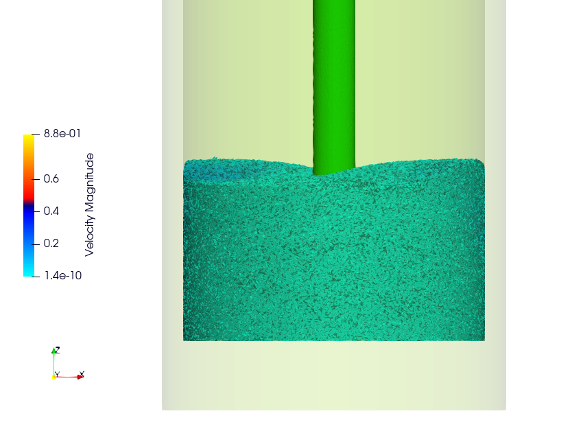
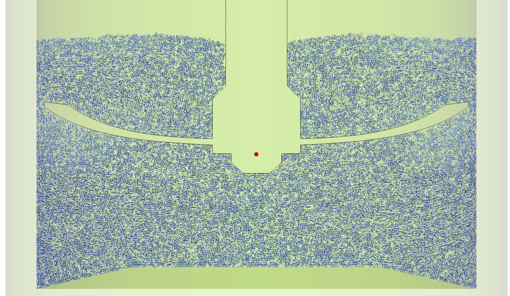
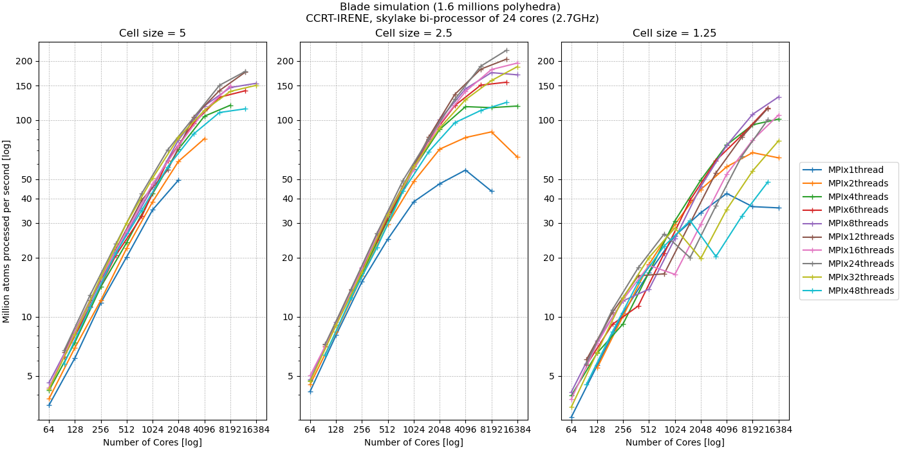
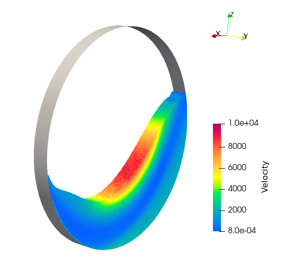
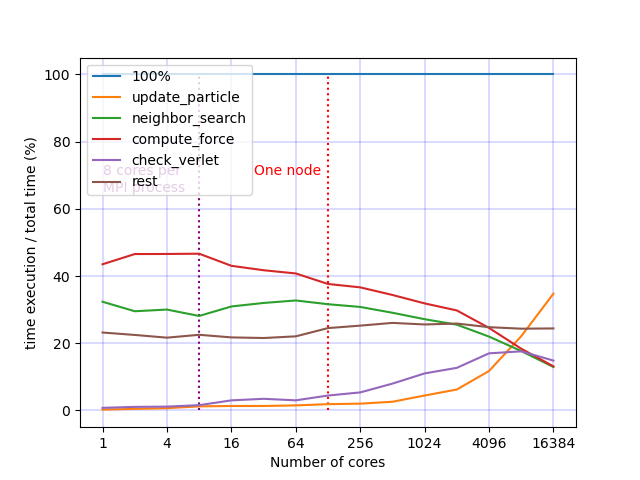

Parallelization
===============

MPI Parallelization
^^^^^^^^^^^^^^^^^^^

Domain Decomposition
--------------------

Cost Model
----------

The weight associated with each cell used for load distribution using the RCB method is as follows: 

.. math::

   W_i=1+3.P_i+\sum_{j \in {0,...,N_i}}[F(I_i[j].type)]

with :math:`W_i` the array of weights, ``i`` is the cell id, :math:`I_i` the interactions into the cell ``i`` , :math:`P_i` the number of particles into the cell ``i``, :math:`N_i` is the number of interactions, and ``F`` is the cost function associated to the interaction type.

.. list-table:: F values
   :widths: 20 25 20
   :header-rows: 1

   * - Value
     - Type 
     - F(Value)
   * - 0
     - Vertex - Vertex
     - 1
   * - 1
     - Vertex - Edge
     - 3
   * - 2
     - Vertex - Face
     - 5
   * - 3
     - Edge - Edge
     - 4
   * - 4
     - Vertex - Cylinder
     - 1
   * - 5
     - Vertex - Surface
     - 1
   * - 6
     - Vertex - Ball
     - 1
   * - 7
     - Vertex - Vertex (STL)
     - 1
   * - 8
     - Vertex - Edge (STL)
     - 3
   * - 9
     - Vertex - Face (STL)
     - 5
   * - 10
     - Edge - Edge (STL)
     - 4
   * - 11
     - Vertex (STL) - Edge
     - 3
   * - 12
     - Vertex (STL) - Face
     - 5

Thread Parallelization
^^^^^^^^^^^^^^^^^^^^^^

GPU Support
^^^^^^^^^^^

Benchmarks
^^^^^^^^^^

Balde - CPU (Polyhedron)
------------------------

Information:

- Balde: {25,952 faces, 77,856 edges, 28,497 vertices}
- Number of timesteps: 10,000
- Number of polyhedra: 1,651,637
- This benchmark is achieved by reproducing the tutorial simulation (Blade) with polyhedra 5 times smaller. See images below.
- Test the hybrid parallelization ``MPI + OpenMP``  
- Machine used: CCRT-IRENE with:

   - Node: bi-processor of skylake
   - Each processor has 24 cores 
   - Frequency: 2.7GHz
   - until 16,384 core

Some remarks:

- For this test, the simulation domain is split into 39,000 cells and then distributed among the MPI processes. Some configurations fail because there are not enough cells per ``MPI`` process. 
- Best results are obtained with 24 ``OMP`` threads per MPI process. This corresponds to the number of cores per socket. NUMA effects are likely to reduce performance beyond this.

Rotating Drum - GPU (Polyhedron)
--------------------------------

This example is defined in the repository: https://github.com/Collab4exaNBody/exaDEM-benchmark/tree/main/rotating-drum-poly . This simulation is run on an a100 GPU using 32 cores. Result format: Loop time (Update Particles/Force Field).

.. list-table:: GPU Benchmarks
   :widths: 20 40 40
   :header-rows: 1

   * - Version
     - Case 10k 
     - Case 80K
   * - v1.0.1 (06/24)
     - 28.1   ( 17.1 / 6.8)
     - 71.6   ( 37.8 / 26.0)
   * - v1.0.2 (11/24)
     - 23.3   ( 17.7 / 4.1)
     - 48.9   ( 33.0 / 13.8)
   * - master (05/12/24)
     - 6.38   ( 2.61  / 2.49)
     - 17.6   ( 11.65 / 4.3)
   * - v1.1.0 (27/03/25)
     - 6.99   ( 2.43  / 2.56)
     - 17.3   ( 10.94 / 4.4)
   * - v1.1.2 (22/07/25)
     - 10.4   ( 1.99 / 5.37)
     - 16.59  ( 9.35 / 4.2)
   * - v1.1.3 (01/09/25)
     - 10.77  ( 1.9 / 5.7)
     - 16.23  ( 9.0 / 4.1)
   * - v1.1.4 (24/09/25)
     - 8.36   ( 3.5  / 2.4)
     - 18.0   ( 10.8 / 4.1)
   * - v1.1.5 (26/10/25)
     - 8.44   ( 3.3  / 2.6)
     - 18.0   ( 10.8 / 4.1)

Rotating Drum - CPU (Sphere)
----------------------------

.. |bench1-picture-mpi| image:: ../../_static/mpi-dem-example-100M-mpi.png
.. |bench1-graph1| image:: ../../_static/drum_dem_100M.png
.. |bench1-graph2| image:: ../../_static/drum_dem_100M_comp.png

This benchmark has been presented in 2023 within the paper :cite:`Carrard_2024` : "ExaNBody : a HPC framework for N-Body applications". 

.. note::

  We are no longer able to reproduce this performance as the code has changed (hopefully for the better), but it shows the performance of the first prototype. The input files are no longer available either, as the operators have changed and the data structures have changed, notably with the improvements for interaction and parallelization per interaction instead of per particle in `OpenMP`/`gpu`. 

Description:

Different OpenMP/Mpi configurations (number of cores/threads per ``mpi`` process) have been tested to balance multi-level parallelism. 
Both simulations were instrumented during 1,000 representative iterations. 
The performance of ``ExaDEM`` was evaluated using up to 256 cluster nodes, built on bi-socket 64-core AMD EPYC ``Milan`` 7763 processors running at 2.45 GHz and equipped with 256 GB of RAM.

   Dem simulation of 100 million spheres in a rotating drum.

ExaDEM's performance is evaluated with a simulation of a rotating drum containing 100 million spherical particles, see the figure below. 
This setup is a tough benchmark as particles are rapidly moving all around the heterogeneously dense domain due to gravity. 
Additionally, the employed contact force model has a low arithmetic intensity, and ``exaDEM`` must handle pairwise friction information that is updated by kernel and must migrate between ``mpi`` processes when subdomains are redistributed. 

.. figure:: ../../_static/mpi-dem-example-100M-mpi.png
   :scale: 90%
   :align: center

   Domain decomposition of 100,000 spheres into a rotating drum

.. figure:: ../../_static/drum_dem_100M.png
   :scale: 70%
   :align: center

   Speedup for different OpenMP/MPI configurations. ExaDEM simulation with 1, 8, and 128 threads per ``mpi`` process.

.. note::

  Note that the ``Milan`` nodes are made up of 128 cores spread over 8 NUMA nodes, and we have pointed out that NUMA effects reduce overall performance.

.. figure:: ../../_static/drum_dem_100M_comp.png
   :scale: 70%
   :align: center

   Operator speedup according to the total number of cores used.

   Operator time ratios at different parallelization scales.
