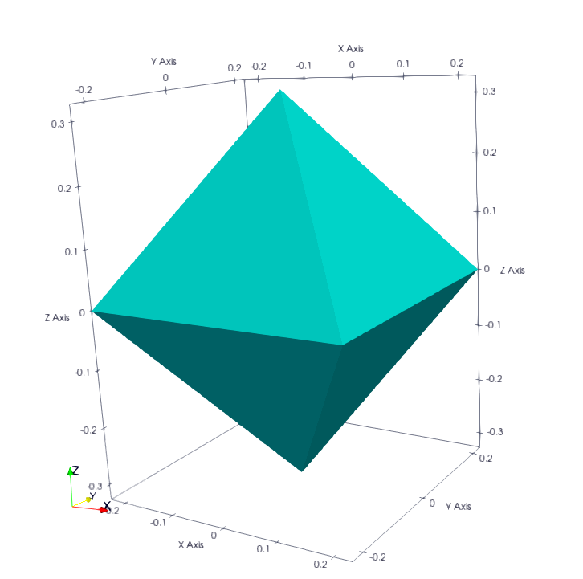
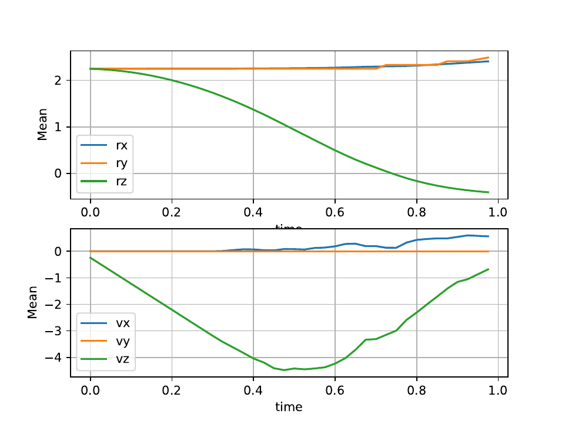

Input/Output
============

In this section, we will describe the various operators used for analysis and I/O in DEM simulations.

Configuration
-------------

IO Configuration
^^^^^^^^^^^^^^^^

This operator is used to define the tree structure of output files. By default, exaDEM proposes a tree structure with names defined in the `config_exaDEM` file. You can override this operator yourself by redefining it in the `io_tree` operator.

- Name: `io_config`
- Description: This operator defines the tree structure of output files.
- Parameters:
   * `avg_stress_tensor_name` : Write an output file containing stress tensors.
   * `dir_name` : Main output directory.
   * `interaction_basename` : Write an output file containing interactions.
   * `log_name` : Write an Output file containing log lines.

YAML example:

.. code-block:: yaml

  - io_config:
     dir_name: "ExaDEMOutputDir"
     log_name: "log.txt"
     avg_stress_tensor_name: "AvgStressTensor.txt"
     interaction_basename: "InteractionOutputDir-"

Checkpoint/Restart Operators
----------------------------

Reader Of xyz File
^^^^^^^^^^^^^^^^^^

- Name: `read_xyz`
- Description: This operator reads a file written according to the xyz format.
- Parameters:
   * `bounds_mode` : default mode corresponds to ReadBoundsSelectionMode.
   * `enlarge_bounds` : Define a layer around the volume size in the xyz file. Default size is 0.
   * `file` : File name, this parameter is required.
   * `pbc_adjust_xform` : Adjust the form.

YAML example: 

.. code-block:: yaml

 - read_xyz:
   file: input_file_rigid_surface.xyz
   bounds_mode: FILE
   enlarge_bounds: 1.0 m

How to build your xyz input file of `nb` particles.

.. code-block:: python

 nb
 box_size_x box_size_y box_size_z
 type_0 pos_x_0 pos_y_0 pos_z_0
 type_1 pos_x_1 pos_y_1 pos_z_1
 type_2 pos_x_2 pos_y_2 pos_z_2
 ...
 type_nb-1 pos_x_nb-1 pos_y_nb-1 pos_z_nb-1

This is an example of two particles the same type in a domain [[0,0,0],[10,10,10]].

.. code-block:: python

 2
 10 10 10
 0 2.5 5.0 5.0
 0 7.5 5.0 5.0

Reader Of MPIIO File
^^^^^^^^^^^^^^^^^^^^

- Name: `read_dump_particles`
- Description: This operator reads a dump file with all particle information required to restart the simulation. See operator: @write_dump_particles
- Parameters:
   * `filename` : Dump file name to read.
   * `bounds` : If set, override the domain's bounds, filtering out particles outside of overriden bounds (AABB = [[infx, infy, infz],[supx, supy, supz]]).
   * `expandable` : If set, override domain expandability stored in file
   * `periodicity` : If set, overrides the domain's periodicity stored in a file with this value (ex: [false,true,false]).
   * `scale_cell_size` : If set, this option rescales cell size. Due to friction storage per cell, ou can only multiply this size by an integer (1,2,4, 8, ...) or divide it by a power of 1/(2^n) (0.5,0.25 ...).
   * `shrink_to_fit` : If set to true and bounds were specified, try to reduce the domain's grid size to the minimum size enclosing fixed bounds.

YAML example:

.. code-block:: yaml

  - read_dump_particles:
      filename: last.dump

.. note::
  This operator is used for spheres and not polyhedra because we need a special reader to read current interaction values containing the friction and moment. Show `read_dump_particle_interaction`.

Restart file script
^^^^^^^^^^^^^^^^^^^

In the `scripts` folder, you have the option of using a script ``restart_template.py`` that will enable you to quickly write the restart section of your simulation by directly retrieving the path to any saved files. This script directly includes whether the simulation mode is spherical or polyhedral. If the mode is polyhedral, the shape file will also be loaded automatically. The script will also check for a file containing driver data and include it. Finally, it will also include the last dump file (highest iteration). 

Option:

* `directory`: Output file path, the default path is `ExaDEMOutputDir`. Note that it should contains a subdirectory named: `CheckpointFiles` and this output file path is defined into the operator ``io_tree``.

Example: 

.. code-block:: bash

   python3 ~/exaDEM/scripts/restart_template.py --directory SpheresMovableWallDir

Output:

.. code-block:: bash

   Restart directory: SpheresMovableWallDir
   Particle mode: Spheres 
   Last iteration identified: 29000
   Here s a template for restarting your simulation at the last saved iteration: 
   
   includes:
     - config_spheres.msp
     - SpheresMovableWallDir/CheckpointFiles/driver_0000029000.msp
   
   input_data:
     - read_dump_particle_interaction:
        filename: SpheresMovableWallDir/CheckpointFiles/exadem_0000029000.dump

Reader Of Rockable Files
^^^^^^^^^^^^^^^^^^^^^^^^

- Name: `read_conf_rockable`
- Description: This operator reads a rockable output file. However, some lines are not processed by the reader, such as the contact law type or its parameters.
- Paramters:
   * `bounds` This option defines the simulation domain. If not specified, the domain size is determined by the particle positions. Ex: [[0,0,0],[1,1,1]].
   * `filename` Dump file name to read.
   * `enlarge_bounds` Define a layer around the volume size. Default size is 0.

Yaml Example:

.. code-block:: yaml

  input_data:
    - read_conf_rockable:
       filename: input_file/518_poly.conf

What is read:

- t
- dt
- density
- periodicity
- nDriven
- shapeFile
- precision
- Particles
- Interactions (read but NOT used)

What is not read:

- Interactions (read but NOT used)
- Interfaces
- gravity
- AddOrRemoveInteractions
- UpdateNL
- forceLaw
- Contact law parameters
- interVerlet
- interConf
- tmax
- DVerlet
- dVerlet
- gravity
- ParamsInInterfaces
- dynamicUpdateNL
- ContactPartnership
- cellMinSizes
- iconf
- boxForLinkCellsOpt

Read Shape File
^^^^^^^^^^^^^^^

The purpose of this operator is to add shapes to a collection of shapes. This operator can be called as many times as desired. However, if you add the same shape multiple times, it will create duplicates. Additionally, the shapes will be ordered according to the order of reading, meaning that type 0 will be associated with the first shape from the first input file. Furthermore, this operator will automatically create a polydata for each shape, which will be used for displaying the polyhedra using ParaView.

.. note::

  The output Paraview file does not incorporate the "spherical" characteristics of polyhedra, i.e. surfaces are created by connecting the centers of vertices, edges are straight lines (instead of cylinders), and vertices are points (instead of spheres).

* `read_shape_file` :
   * `filename`: Input file name, no default name.
   * `scale_factor`: This option 'scale_factor' the input shapes. OBB, volume, vertices, and intertia are recomputed. Note that a vector of double should be provided. Example: scale_factor: [1.2,1,5.2].
   * `rename`: This option renames the input shapes. Note that a vector of string should be provided. Example: rename: [Shape1, Shape2, Shape3].
   * `rescale_minskowski`: This option disable the rescaling of the minskowski radius.
   * `verbosity`: It displays the typename and typeid.

Warnings:

.. warning::

  * This operator takes on ASCII files.
  * This operator is not typo-proof and will ignore problematic values.
  * Do not define a shape "driven" such as a wall or a cylinder because the cell diameters and the cutoff radius for creating interaction lists are derived from the shapes of the polyhedra. These should be defined in specific operators if they have an analytical shape. If they have particular shapes with many facets, please use the RShape Driver reader (supported extension: `shp` or `stl`).

YAML example:

.. code-block:: yaml

  - read_shape_file:
     filename: shapes.shp

  - read_shape_file:
     filename: shapes.shp
     rename: [PolyR, Octahedron]

  - read_shape_file:
     filename: shapes.shp
     rename:       [ PolyRSize2, OctahedronSize2]
     scale_facton: [        2.0,             2.0]

Example of a shape:

.. code-block:: python

  <
  name Octahedron
  radius 0.1
  preCompDone y
  nv 6
  0.2310789034541148 -0.2310789034541148 0.0
  0.2310789034541148 0.2310789034541148 0.0
  0.0 0.0 0.32679491924311227
  -0.2310789034541148 -0.2310789034541148 0.0
  -0.2310789034541148 0.2310789034541148 0.0
  0.0 0.0 -0.32679491924311227
  ne 12
  0 1
  2 1
  2 0
  0 3
  2 3
  3 4
  4 2
  4 1
  5 0
  5 1
  5 4
  5 3
  nf 8
  3 0 1 2 
  3 2 3 4 
  3 1 2 4 
  3 0 2 3 
  3 0 5 1 
  3 0 5 3 
  3 3 5 4 
  3 4 5 1 
  obb.extent 0.33107890345411484 0.33107890345411484 0.4267949192431123
  obb.e1 1.0 0.0 0.0
  obb.e2 0.0 1.0 0.0
  obb.e3 0.0 0.0 1.0
  obb.center 0.0 0.0 0.0
  position 0.0 0.0 0.0
  orientation 1.0 0.0 0.0 0.0
  volume 0.16666666666666666
  I/m 0.04999999999999999 0.04999999999999999 0.04999999999999999
  >

Example of `Octahedron.vtk` with paraview:

Writer Of MPIIO Files
^^^^^^^^^^^^^^^^^^^^^

- Name: `write_dump_particles`
- Description: This operator writes a dump file with all particle information required to restart the simulation. See operator: @read_dump_particles.
- Parameters:
   * `compression_level` Zlib compression level.
   * `filename` Dump output file name.
- Default behaviour: the default name is defined by : `- timestep_file: "exaDEM_%09d.dump` and piloted by `simulation_dump_frequency: 1` in the operator `global`.

.. note::
  This operator is defined in the default `ExaDEM` operator named `dump_data_particles`. 

Writer Of Rockable Files
^^^^^^^^^^^^^^^^^^^^^^^^

- Name: `write_conf_rockable`
- Description: This operator writes a minimal rockable output file to use the rockable tool `see`.
- No parameter

YAML example:

.. code-block:: yaml

   iteration_dump_writer:
     - write_conf_rockable

.. note::

  Only particles data are writen to use the rockable tool `see`.

Writer Of XYZ Files
^^^^^^^^^^^^^^^^^^^

- Name: `write_xyz`
- Description: This operator writes a txt file (`.xyz`) with all specified fields.
- Parameters:
  * `fields`: array of fieldsets. Example: ``[ id, velocity, radius ]``
  * `filename`: name of the output file.
  * `units`: array of units. Example: ``{ velocity: "m/s", radius: "m" }``

.. note:: 
  The first line of the output file contains the number of particles. The second line contains the “lattice” description, useful when using ovito.

YAML example: Replaces MPIIO output files with xyz files. 

.. code-block:: yaml

  dump_data_xyz:
    - timestep_file: "dem_pos_vel_%09d.xyz"
    - write_xyz:
       fields: [ id, velocity, radius ]
       units: { velocity: "m/s", radius: "m" }

  iteration_dump_writer:
    - dump_data_xyz

  global:
    simulation_dump_frequency: 500

To process these files, a sample script is provided in ``scripts/post_processing/profile_pos_vel.py``. This is a minimal, easily modifiable post-processing file that calculates the averages of all position and velocity components.

Output file: [mean_r_v.pdf]

