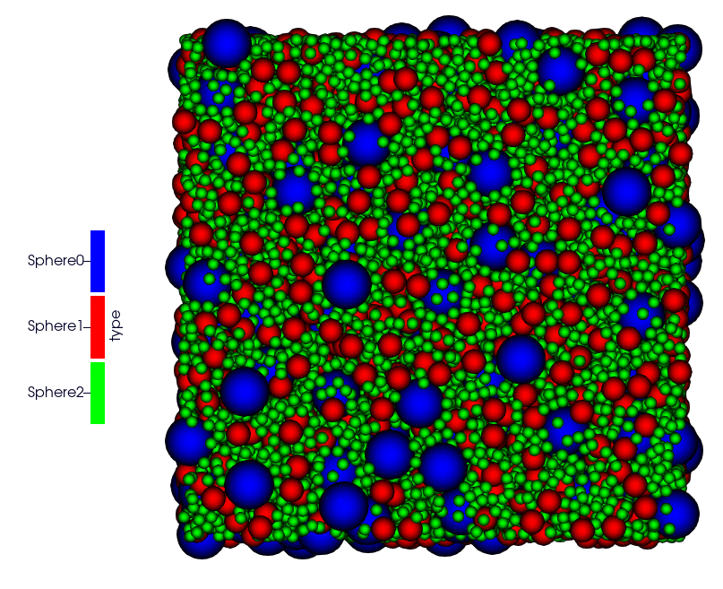

External Packages
=================

RSA_MPI package
---------------

``RSA MPI`` is a HPC library dedicated to generating random configurations non-intersecting balls, with an unbiased the RSA algorithm. The sequential strategy based on Ebeida et al, 2012. This strategy has been extended to the MPI framework, as decribed in this paper "Parallel and bias-free RSA algorithm for~maximal Poisson-sphere sampling, Josien & Prat (in preparation)".

* Operator name: ``rsa_rnd_rad``
* Parameters:

  * *enlarge_bounds*: Add an empty layer around your domain. Default is 0.0.
  * *periodicity*: if set, overrides domain's periodicity. 
  * *bounds*: Override domain's bounds, filtering out particle outside of overriden bound.
  * *type* : Define particle, default is 0.
  * *expandable* : if set, override domain expandability.
  * *r_min* : Value of the smallest radius possible.
  * *r_max* : Value of the largest radius possible.
  * *n_max* : Maximal number of particles. Default is `1e16`.
  * *region* : The region where the sample is generated.

YAML examples:

.. code:: yaml

  - rsa_rnd_rad:
     bounds: [[ -4.97 , -4.97 , 1 ] , [ 4.97 , 4.97 , 150 ] ]
     r_min: 0.04
     r_max: 0.05
     n_max: 6000000
     region: MYSUPERZONE
     type: 0

* Operator name: ``rsa_vol_frac``

* Description: This operator initializes a grid with particles using the RSA (Random Sequential Adsorption) MPI-based algorithm. It allows the user to control particle generation via geometric constraints, volume fractions, and particle type definitions. This is intended for use only at simulation initialization.

* Parameters:
    * *particle_type_map*: Mapping between particle type names and their internal identifiers.
    * *enlarge_bounds*: Add an empty layer around the domain. Default is 0.0.
    * *bounds_mode*: Controls how bounds are interpreted: from file or overridden manually.
    * *periodicity*: If set, overrides domain's periodicity.
    * *expandable*: If set, overrides domain expandability.
    * *bounds*: Override domain bounds. Particles outside of these bounds will be filtered out.
    * *params*: List of RSA particle parameters. Each entry defines [radius, volume fraction, type name].
    * *region*: Optional Constructive Solid Geometry (CSG) region used to restrict particle placement.

YAML examples:

.. code:: yaml

  - particle_type:
     type: [ Sphere0 , Sphere1 , Sphere2 ]
  - rsa_vol_frac:
      periodic: [true,true,false]
      bounds: [ [ 10 , 10 , 10 ] , [ 14, 14, 14] ]
      params: [[0.5, 0.1, Sphere2], [0.25, 0.1, Sphere1], [0.125, 0.1, Sphere0]]
  - set_fields:
     polyhedra: false
     type:              [ Sphere2 , Sphere1 , Sphere0 ]
     radius:            [     0.5 ,    0.25 ,   0.125 ]
     velocity:          [ [0,0,0] , [0,0,0] , [0,0,0] ]
     sigma_velocity:    [   0.001 ,   0.001 ,   0.001 ]
     density:           [    0.02 ,    0.02 ,    0.02 ]

.. note::

  The domain defined by bounds must match a multiple of the cell size defined in the domain operator. This operator does not require init_rcb_grid to be set.

