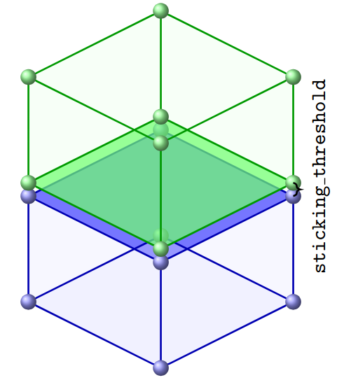
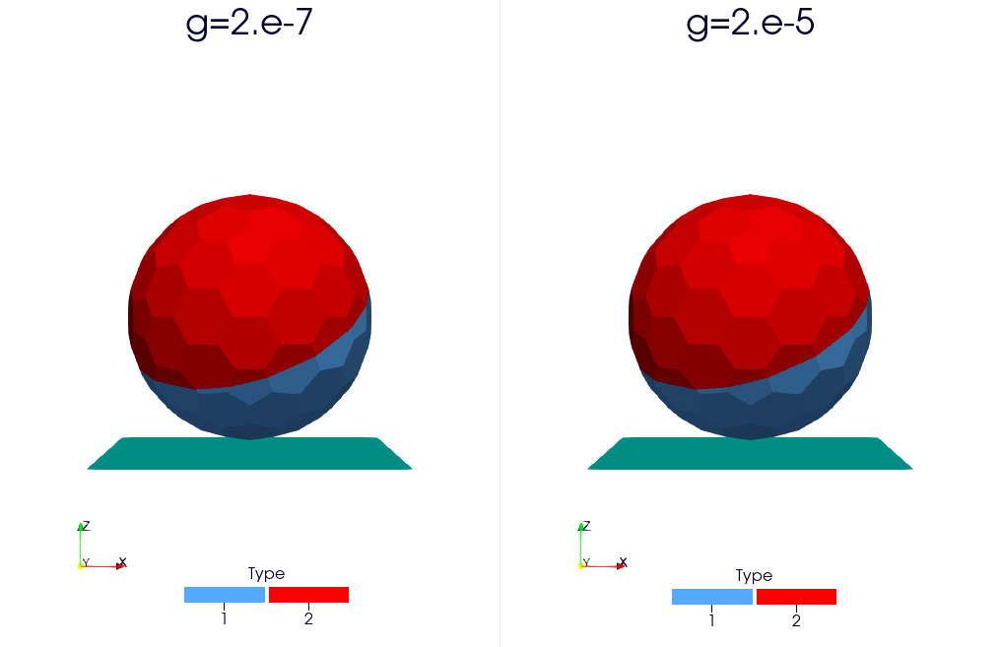
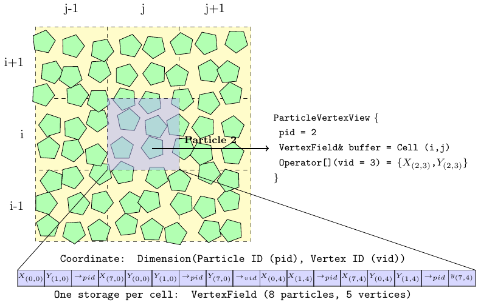

R-Shape / Polyhedron
====================

In this section, we describe the various concepts used to build simulations with R-shape or sphero-polyhedron particles.

Overview
^^^^^^^^

The polyhedra implemented in ``ExaDEM`` are sphero-polyhedra: the vertices are treated as spheres and the edges as cylinders. To achieve this, ``ExaDEM`` reuses many features of the ``Rockable`` DEM code developed at CNRS (https://github.com/richefeu/rockable, https://richefeu.github.io/rockable/quickStart.html). It relies in particular on a ``Shape`` class, which stores a polyhedron's geometry (vertices, edges, faces, and Minkowski radius), and an interaction class used to qualify contacts between polyhedra. The sphero-polyhedron approach can also represent complex non-convex particles such as hexapods.

Shape
^^^^^

The ``Shape`` class stores a polyhedron's vertices, edges, and faces, plus extra data to speed up calculations, such as an ``OBB`` (Oriented Bounding Box) per element. ``ExaDEM`` provides several operators around this class, such as reading ``.shp`` files (the format used by ``Rockable``) or exporting a shape to ``.vtk`` for visualization. Its properties are:

.. list-table:: Shape Class Properties
   :widths: 25 25 50
   :header-rows: 1
   :align: center

   * - Property Name
     - Attribute Name
     - Description
   * - Vertices
     - ``m_vertices``
     - List of the polyhedron's vertices.
   * - Edges
     - ``m_edges``
     - List of the polyhedron's edges.
   * - Faces
     - ``m_faces``
     - List of the polyhedron's faces.
   * - Minkowski Radius
     - ``m_radius``
     - Minkowski radius (radius of the vertices).
   * - Volume
     - ``m_volume``
     - Total volume of the polyhedron.
   * - Inertia Coefficient
     - ``m_inertia_on_mass``
     - Inertia coefficient normalized by mass.
   * - Name
     - ``m_name``
     - Name of the object (defaults to "undefined").
   * - OBB
     - ``obb``
     - Oriented Bounding Box of the polyhedron.
   * - Vertex OBBs
     - ``m_obb_vertices``
     - List of ``OBB`` for each vertex (only for ``Big Shape``).
   * - Edge OBBs
     - ``m_obb_edges``
     - List of ``OBB`` for each edge.
   * - Face OBBs
     - ``m_obb_faces``
     - List of ``OBB`` for each face.

.. note::

  Each OBB is enlarged by the shape's Minkowski radius.

.. note::

  Every shape is stored in a shared list, and the simulation's cut-off radius is deduced from
  the largest shape in that list. A cut-off radius that is too large can drastically reduce
  performance, so avoid adding very large shapes through ``read_shape_file``; define them as
  ``drivers`` instead.

Shape example (octahedron, 6 vertices, 12 edges, and 8 faces):

.. code-block:: bash

  <
  name Octahedron
  radius 0.1
  preCompDone y
  nv 6
  0.2310789034541148 -0.2310789034541148 0.0
  0.2310789034541148 0.2310789034541148 0.0
  0.0 0.0 0.32679491924311227
  -0.2310789034541148 -0.2310789034541148 0.0
  -0.2310789034541148 0.2310789034541148 0.0
  0.0 0.0 -0.32679491924311227
  ne 12
  0 1
  2 1
  2 0
  0 3
  2 3
  3 4
  4 2
  4 1
  5 0
  5 1
  5 4
  5 3
  nf 8
  3 0 1 2
  3 2 3 4
  3 1 2 4
  3 0 2 3
  3 0 5 1
  3 0 5 3
  3 3 5 4
  3 4 5 1
  obb.extent 0.33107890345411484 0.33107890345411484 0.4267949192431123
  obb.e1 1.0 0.0 0.0
  obb.e2 0.0 1.0 0.0
  obb.e3 0.0 0.0 1.0
  obb.center 0.0 0.0 0.0
  position 0.0 0.0 0.0
  orientation 1.0 0.0 0.0 0.0
  volume 0.16666666666666666
  I/m 0.04999999999999999 0.04999999999999999 0.04999999999999999
  >

Or a sphere (1 vertex, 0 edges, 0 faces):

.. code-block:: bash

  <
  name alpha1
  radius 0.5
  preCompDone y
  nv 1
  0 0 0
  ne 0
  nf 0
  obb.extent 0.5 0.5 0.5
  obb.e1 1 0 0
  obb.e2 0 1 0
  obb.e3 0 0 1
  obb.center 0 0 0
  volume 0.523598775598299
  I/m 0.1 0.1 0.1
  >

Using a spherical shape in a polyhedron configuration instead of a native sphere configuration decreases performance, due to unnecessary calculations such as applying an orientation to a single vertex -- about 2 to 3 times slower in our benchmarks.

* Operator Name: ``read_shape_file``
* Description: This operator initializes the shapes data structure from a shape input file.
* Parameters:

  * ``filename``: Input file name (.shp)
  * ``scale_factor``: rescale all shapes. Optional parameter.
  * ``rename``: rename all shapes. Optional parameter

YAML example:

.. code-block:: yaml

    - read_shape_file:
       filename: shapes.shp
       rename: [PolyR, Octahedron]
    - read_shape_file:
       filename: shapes.shp
       rename:       [ PolyRSize2, OctahedronSize2]
       scale_factor: [        2.0,             2.0]

Example: See :ref:`test_case_rescale_shape` .

Basic Shapes
^^^^^^^^^^^^

``ExaDEM`` provides some basic shapes without using a shape file.

* Operator Name: ``add_sphere``
* Description: Adds a sphere to the shape list.
* Parameters:

  * ``name``: Set the shape's name. Default is "sphere".
  * ``minkowski``: Set the Minkowski (radius) value.

.. code-block:: yaml

  - add_sphere:
     name: MySphere
     minkowski: 1.0

* Operator Name: ``add_cube``
* Description: Adds a cube to the shape list.
* Parameters:

  * ``length``: Set the cube's edge length.
  * ``name``: Set the shape's name. Default is "cube".
  * ``minkowski``: Set the Minkowski (radius) value.

YAML example:

.. code-block:: yaml

  - add_cube:
     name: MyCube
     length: 0.5
     minkowski: 0.25

* Operator Name: ``add_rice``
* Description: Adds a rice-shaped particle to the shape list.
* Parameters:

  * ``length``: Set the rice's length.
  * ``name``: Set the shape's name. Default is "rice".
  * ``minkowski``: Set the Minkowski (radius) value.

YAML example:

.. code-block:: yaml

  - add_rice:
     name: MyRice
     length: 0.5
     minkowski: 0.025

.. image:: ../../_static/rice_bowl.gif
   :align: center
   :width: 300pt

.. _interaction_type_poly:

Polyhedra - Interaction / Contact
^^^^^^^^^^^^^^^^^^^^^^^^^^^^^^^^^

The ``exaDEM::Interaction`` class models a contact between two polyhedra, or between a polyhedron and a ``driver``. It identifies the two elements involved and characterizes the kind of contact between them.

.. note::

   This page describes how interactions are identified and stored; the contact law itself
   (``hooke``, ``cohesive``, ``dmt``) and its parameters (``kn``, ``kt``, ``kr``, ``mu``,
   ``damp_rate``, and, for cohesive/DMT variants, ``fc``/``dncut``/``gamma``) are defined on the
   Force Field page, see :ref:`force_field_contact_law_operators`.

**Interaction Class Attributes:**

* :math:`id_i` and :math:`id_j`: Id of both polyhedra.
* :math:`cell_i` and :math:`cell_j`: Indices of the cells containing the interacting polyhedra.
* :math:`p_i` and :math:`p_j`: Positions of the polyhedra within their respective cells.
* :math:`sub_i` and :math:`sub_j`: Indices of the vertex, edge, or face of the polyhedron involved in the interaction.
* ``type``: Type of interaction (integer), see the glossary below.
* ``friction`` and ``moment``: Temporary storage for contact-law computations.

.. note::
  When the interaction is between a polyhedron and a ``driver``, particle j locates the driver: ``cell_j`` is the driver's index, and, for drivers that carry a shape (``RShapeDriver``), ``sub_j`` stores the index of the involved vertex, edge, or face.

.. list-table:: Glossary of ``Interaction`` types
   :widths: 10 25 65
   :header-rows: 1

   * - Value
     - Type
     - Description
   * - 0
     - Vertex - Vertex
     - Contact between two vertices of two different polyhedra
   * - 1
     - Vertex - Edge
     - Contact between a vertex and an edge of two different polyhedra
   * - 2
     - Vertex - Face
     - Contact between a vertex and a face of two different polyhedra
   * - 3
     - Edge - Edge
     - Contact between two edges of two different polyhedra
   * - 4
     - Vertex - Cylinder
     - Contact between a vertex of a polyhedron and a cylinder
   * - 5
     - Vertex - Surface
     - Contact between a vertex of a polyhedron and a rigid surface or wall
   * - 6
     - Vertex - Ball
     - Contact between a vertex of a polyhedron and a ball / sphere
   * - 7
     - Vertex - Vertex (Driver)
     - Contact between a vertex of a polyhedron and a vertex of a RShape Driver
   * - 8
     - Vertex - Edge (Driver)
     - Contact between a vertex of a polyhedron and an edge of a RShape Driver
   * - 9
     - Vertex - Face (Driver)
     - Contact between a vertex of a polyhedron and a face of a RShape Driver
   * - 10
     - Edge - Edge (Driver)
     - Contact between an edge of a polyhedron and an edge of a RShape Driver
   * - 11
     - Vertex (Driver) - Edge
     - Contact between a vertex of a RShape Driver and an edge of a polyhedron
   * - 12
     - Vertex (Driver) - Face
     - Contact between a vertex of a RShape Driver and a face of a polyhedron
   * - 13
     - Inner Bond
     - Contact within a grain composed of fragments (polyhedra)

**Interaction Class Usage:**

The class's attributes identify the cells, positions, and interaction type of a given contact, which simulation computations then use to model that contact accurately.

Interactions are the unit of intra-node parallelization, on both ``CPU`` and (upcoming) ``GPU`` implementations. They are built by the ``nbh_polyhedron`` operator and then processed by ``contact_polyhedron``.

**Grid Of Interactions:**

Interactions are stored in a grid of cells (an Array-of-Structures-of-Arrays): each cell (a Structure of Arrays) holds a ``GridExtraDynamicDataStorageT``, essentially a vector of ``Interaction``\ s paired with a vector of particle information. This layout makes it straightforward to migrate interaction data between ``MPI`` processes for interactions considered always active (i.e. the two polyhedra stay in contact from one time step to the next). See `src/interaction/include/exaDEM/interaction/grid_cell_interaction.hpp` and the ``extra_storage`` package in ``ExaNBody`` for details.

**Classifier:**

To make ``GPU`` kernels for interactions more efficient, ``exaDEM`` also relies on the ``Classifier`` class, which sorts interactions by type into a Structure of Arrays, so that each kernel launch handles a single interaction type -- reducing instruction divergence between ``GPU`` threads. See :ref:`exadem_views_interactions_classifier` in the Developer Guide for a full description of ``Classifier`` and the ``View`` mechanism it's built on.

This ``Classifier`` complements the interaction grid rather than replacing it: interactions are moved into it (``classify_interactions``) and back out of it (``unclassify_interactions``) only when the underlying data actually changes (cell migration, particle motion, I/O); otherwise they stay classified across time steps.

Using the classifier is currently exaDEM's default strategy for both spheres and polyhedra.

.. _polyhedra_fragmentation:

Fragmentation Feature
^^^^^^^^^^^^^^^^^^^^^

.. note::

  This feature is currently ``experimental``.

``exaDEM`` handles fragmentation by pre-cutting grains into small polyhedra and adding springs between opposite vertices to bond their faces together. To use this feature, include ``config_fragmentation.msp`` instead of ``config_polyhedra.msp``.

.. note::

   This section covers the geometric side of fragmentation: pre-cutting, sticking, and
   interface breakage. The bond *force law* itself and its parameters (``kn``, ``kt``,
   ``damp_rate``, and the fracture criterion ``g`` or ``gn``/``gt``) are defined on the Force
   Field page, see :ref:`force_field_inner_bond_forces`.

 .. figure:: ../../_static/fragmentation_pic.png
   :align: center
   :width: 550pt

Particles stick together when the distance between opposite vertices falls below ``sticking_threshold`` (e.g. ``1.e-04``), set in the ``global`` block alongside ``apply_particle_sticking: true``.

At each time step, ``exaDEM`` then checks every interface -- a set of ``InnerBond`` interactions (type id 13) -- to see whether the released energy exceeds a threshold that depends on the bonded surface area and a parameter ``g``.

When an interface breaks, its interactions are removed and the interaction lists are rebuilt. Note that two particles stuck together by an interface cannot have any other kind of contact (vertex-vertex, vertex-edge, etc.) between them at the same time.

Data layout: Particle Vertices
^^^^^^^^^^^^^^^^^^^^^^^^^^^^^^

Polyhedron vertices are stored in a separate grid structure, ``CellVertexField`` -- a grid of ``VertexField``\ s, reallocated by the ``compute_vertices`` operator. The image below illustrates this memory layout:

* Operator name: ``compute_vertices``
* Description: This operator computes the vertices for every polyhedron.
* Parameters:

  * ``resize_vertex``: Resize the vertex storage to fit the current data. Default is ``true``.
  * ``minimize_memory_footprint``: Size the vertex storage to just the maximum number of vertices actually needed per cell, based on the shapes present in that cell. Useful when a few particles have a much higher vertex count than the rest. Default is ``false``.

YAML examples:

.. code:: yaml

  compute_new_vertices:
    - compute_vertices:
       resize_vertex: true
  compute_fast_vertices:
    - compute_vertices:
       resize_vertex: false
