Post Processings
================

In this section, we will describe the operators related to the usage of polyhedra or spheres.

Dump Paraview For Polyhedra
^^^^^^^^^^^^^^^^^^^^^^^^^^^

In exaDEM, there are two ways to display polyhedra with Paraview: 
   * The first is to directly display the vertices of the polyhedra and the surfaces in parallel VTP (PolyData). However, no fields associated with the polyhedra are available, such as velocity or density.
   * The second solution is to use the generic Paraview output of `exaDEM` by adding the orientation field and the homethety field (optional). Then, it's possible to associate a mesh with each point, such as an `octahedron.vtk` file generated by `read_shape_file`, to each point by associating it with a size (`field::homothety`) and a quaternion (`field::orient`).

.. note::
  Only the default behavior when the `config_polyhedra.msp file` is used is the option 2 that offers more possibilities. In addition, it is important to note that paraview does not include the layer of shape->radius size, i.e. faces are displayed according to the vertex centers.

* Option 1: `write_paraview_generic`
   * `binary_mode` [BOOL] : paraview format file, default is true.
   * `compression` [STRING] : level of compression, default is "default" for vtkZLibDataCompressor.
   * `filename` [STRING]: basename of the parallel paraview output files, default is "output". 
   * `write_ghost` [BOOL]: dump ghost particles, default is false.
   * `write_box` [BOOL]: write box information in a box.vtp file, default is true. 
   * `write_external_box` [BOOL]: write external box (ghost area), default is false. 
   * This operator is based on this function: `ParaviewWriteTools::write_particles`.

YAML example:

.. code-block:: yaml

  write_paraview_generic:
    binary: false
    write_ghost: false
    fields: ["vx","vy","vz","id","orient"]

How to use it with Paraview:

- Firstly, we need to load our reference mesh (Octahedron.vtk) in our case.
- Secondly, load your particle file into the Paraview folder (default name in exaDEM for the paraview_generic operator).
- Thirdly, choose the 3D Glyphs representation and the coloring.

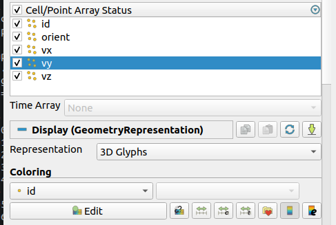

- Fourthly, in the Glyph Parameters section, choose "Orient" with the orientation mode "Quaternion" and as orientation vectors: "orient". To change the size, you can check Scaling and add the Scale Array you wish. Finally, in the Glyph Type dropdown menu, select "Pipeline Connection" and in Input, choose "Octahedron.vtk".

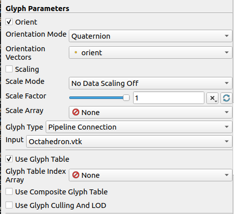

Result for a simulation of 1000 Octahedra falling in a cylinder colored by their ID:

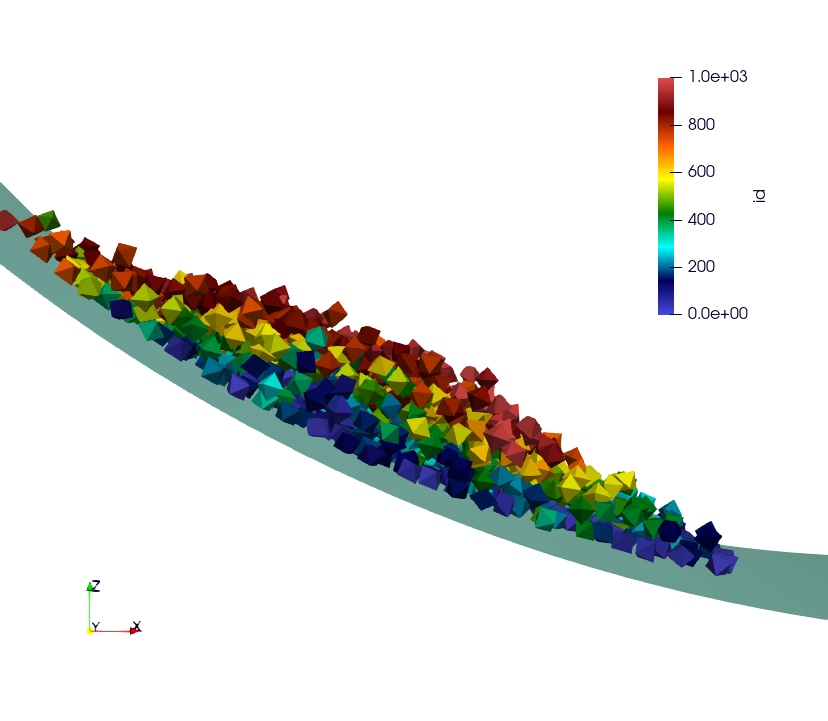

* Option 2: write_paraview_polyhedra
   * `filename` : Name of paraview file, there is no default name. Note that in `ExaDEM`, filename is defined in the default execution stream.
   * `mpi_rank` : Add a field containing the mpi rank. [optional]

YAML example:

.. code-block:: yaml

  particle_write_paraview_generic:
    - write_paraview_polyhedra:
       mpi_rank: true

Example with 850,000 octahedra:

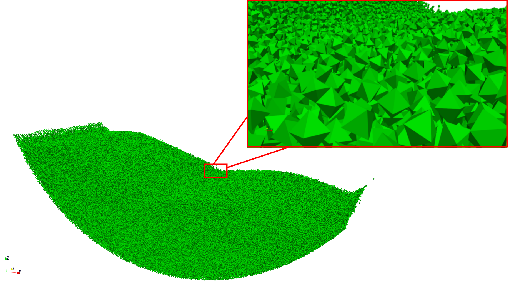

.. note::
	This operator is rather limited in terms of visualization, so we now advise you to use option 1, which offers more possibilities (field display) and less memory-intensive files. 

Dump Paraview With OBBs
^^^^^^^^^^^^^^^^^^^^^^^

This operator allows you to display OBBs around polyhedra in paraview. These files are stored in different files from those used to store polyhedron information. By default, these files are available in the directory `ExaDEMOutputDir/ParaviewOutputFiles/` under the format `obb_%010d.pvtp`. The fields associated with OBBs are the polyhedron ID and type.

* `write_paraview_obb_particle`:
   * `basedir` : Name of the directory where paraview files will be written
   * `basename` : Name of paraview file, there is no default name. Default is "obb".
   * `timestep` : Current simulation time is defined.

.. note::
  This operator is called after `write_paraview_generic` and is triggered by `simulation_paraview_frequency` called into the global operator.

.. warning::
  This operator doesn't work for simulations with spheres.

YAML example:

.. code-block:: yaml

  - write_paraview_obb_particle

Output example:

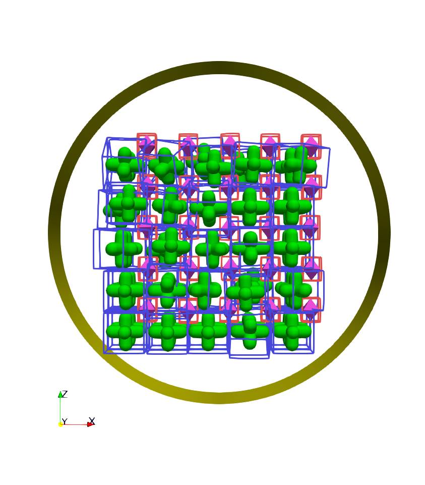

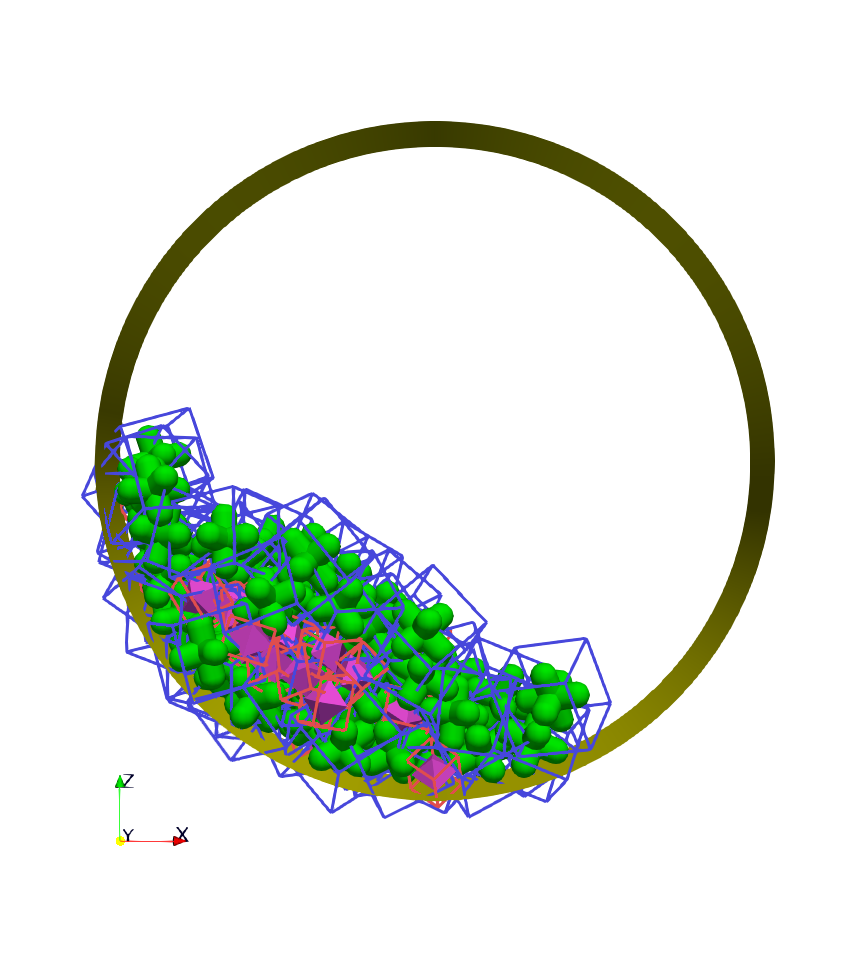

Dump Contact Network
^^^^^^^^^^^^^^^^^^^^

This operator is used to visualize the contact network between polyhedra using ParaView. For each active contact/interaction, we assign the value of the normal force calculated in Contact's law. You can enable this option, which will be automatically triggered at the same time as the other paraview files, with the option ``enable_contact_network: true`` in global. See examples: "Polyhedra/Example 2: Octahedra in a Rotating Drum" and "Spheres/Example 1: Rotating drum".

* `dump_contact_network`:
   * `filename` : Name of the paraview file, there is no default name.  
   * `timestep` : Current simulation time is defined.

YAML example:

.. code-block:: yaml

  - timestep_paraview_file: "ParaviewOutputFiles/contact_network_%010d"
  - dump_contact_network

.. code-block:: yaml

  global:
    enable_contact_network: true

Here is an example of 216 polyhedra after a fall into a cylinder, left the simulation and right the contact network:

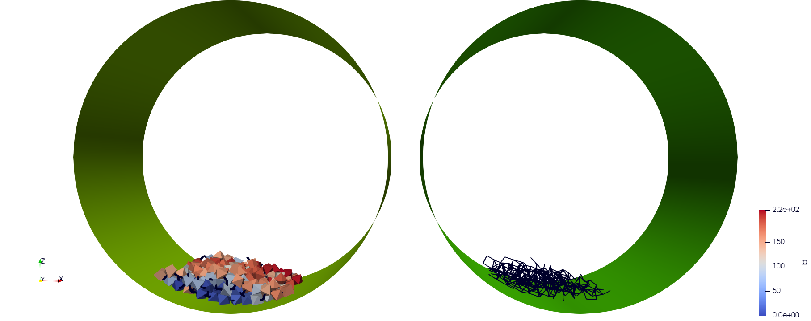

Comments / Extensions:

* This operator can be modified to display more values per contact. To achieve this, you need to change the type of `StorageType` in the `NetworkFunctor` structure. Then, you'll need to populate this function in the operator `() (exaDEM::Interaction* I, const size_t offset, const size_t size)`. Finally, you'll need to add a field in write_pvtp and include this field in `write_vtp`.
* Currently, this operator doesn't take particularly long to execute and isn't called frequently. However, it doesn't benefit from any shared-memory parallelization (OpenMP) because the network storage is implemented using a `std::map`. 

Dump Interaction Data
^^^^^^^^^^^^^^^^^^^^^

This feature outputs the main information for each interaction. This feature has been implemented to enable post-simulation analysis.  
An option has been added to the contact_polyhedron and contact_sphere operators to output interaction data as a CSV file. To activate it, simply modify the value of ``analysis_interaction_dump_frequency`` in the operator block ``global``. 

Output files are located in the `ExaDEMOutputDir/ExaDEMAnalysis` folder. For each iteration (XXX) with file writing, a folder containing an interaction file is created, such as:  `Interaction_XXX/Interaction_XXX_MPIRANK.txt`.

For each interaction, we write:

- The particle identifier i [uint64_t],
- The particle identifier j [uint64_t],
- The sub-identifier of the particle i [int], 
- The sub-identifier of the particle j [int],
- The interaction type [int <= 13],
- The deflection / overlap [double <= 0],
- The contact position [Vec3d], 
- The normal force [Vec3d], 
- The tangential force [Vec3d].

.. warning::

  Inactive interactions have been filtered out when writing output files. In addition, symmetrized interactions are stored one time. 

.. note::

  An example is available in: example/polyhedra/analyses/interaction.msp 

``ExaDEM`` also offers post-processing scripts for basic interaction analyses. The scripts can be used as a basis for developing other analyses according to need. The first available script is `interaction_summary.py` : 

- Read all interaction files
- Plot the number of interactions per type as a	 function of the timestep (`types.pdf`)
- Plot the number of interactions as a function of the timestep (`count.pdf`)

How to run this script:

.. code-block:: bash

  cd ExaDEMOutputDir/ExaDEMAnalyses
  python3 PATH_TO_ExaDEM/scripts/post_processing/interaction_summary.py

Output file examples:

Simulation: near 104,000 octahedral particles over 200,000 timesteps of 5.10^{-5} s falling into a cylinder.

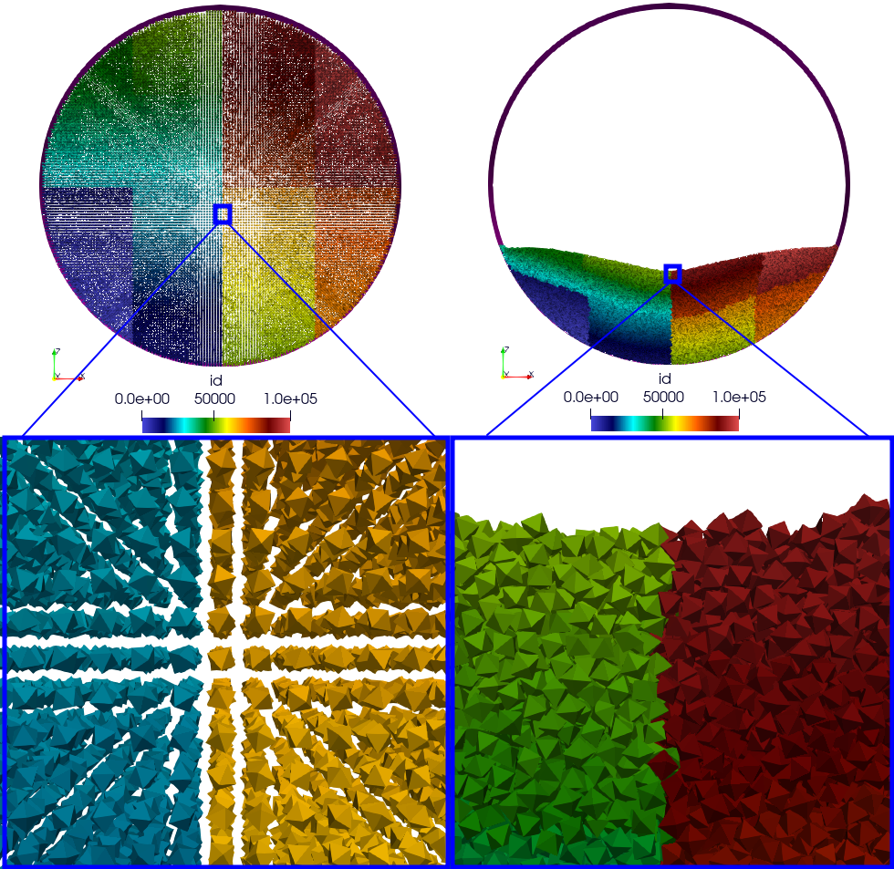

- types.pdf

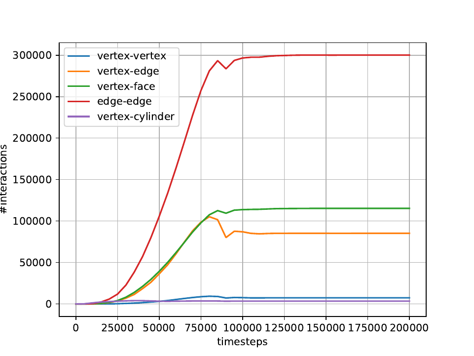

.. note::

  Symmetrized interactions are counted twice within the ``interaction_summary.py`` python script.

- count.pdf

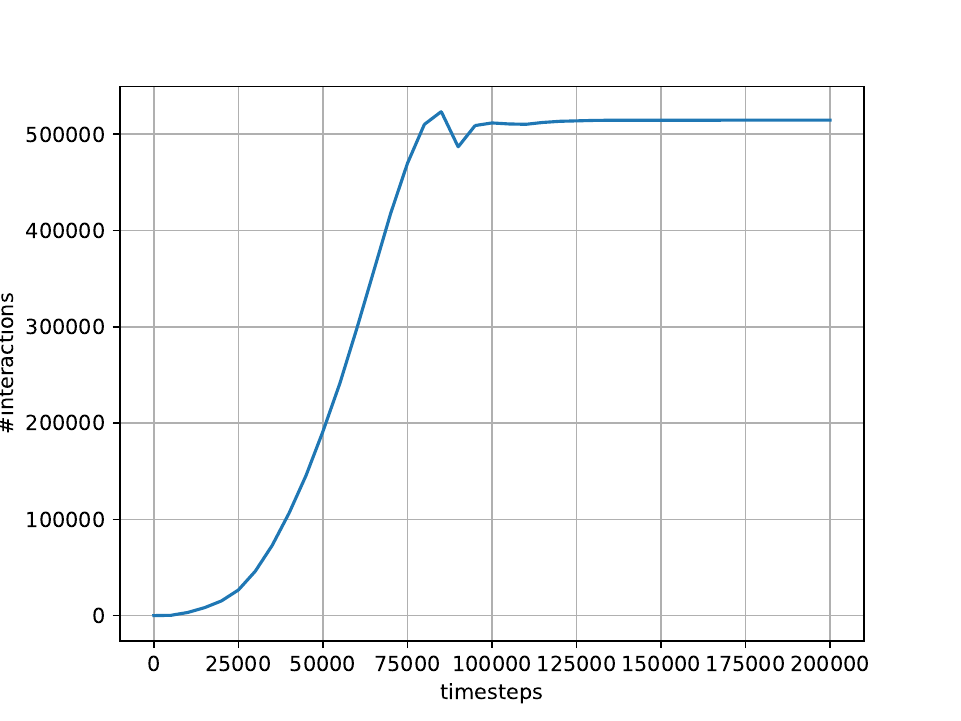

Interaction Summary
^^^^^^^^^^^^^^^^^^^^

This operator allows displaying the total number of interactions, both total and active. An interaction is considered active if there is contact ands consequently, if the cumulative friction is different from Vec3d{0,0,0}. It also enables the separation of different types of interactions: Vertex-Vertex, Vertex-Edge, Vertex-Face, and Edge-Edge.

- Name: `stats_interactions`
- No parameter.
- Tip: Add this operator when performing recurring but infrequent operations such as Paraview outputs or checkpoint output files (see YAML example). 

YAML example:

.. code-block:: yaml

   +dump_data_paraview:
     - stats_interactions

Output example:

.. code-block:: bash

  ==================================
  * Type of interaction    : active / total 
  * Number of interactions : 42058 / 41943
  * Vertex - Vertex        : 0 / 0
  * Vertex - Edge          : 625 / 625
  * Vertex - Face          : 5546 / 5546
  * Edge   - Edge          : 31698 / 31698
  * Vertex - Cylinder      : 0 / 0
  * Vertex - Surface       : 0 / 0
  * Vertex - Ball          : 0 / 0
  * Vertex - Vertex (STL)  : 0 / 0
  * Vertex - Edge (STL)    : 0 / 0
  * Vertex - Face (STL)    : 4060 / 4074
  * Edge   - Edge (STL)    : 0 / 0
  * Edge (STL) - Vertex    : 0 / 0 
  * Face (STL) - Vertex    : 0 / 0
  ==================================

Global Stress Tensor
^^^^^^^^^^^^^^^^^^^^

A stress tensor for a given particle is computed such as: 

.. math::

  \sigma_{loc}=\sum_{ij \in I}[f_{ij} c_{ij}^T]

With ``I`` the active interactions, :math:`f_{ij} = (fx_{ij},fy_{ij},fz_{ij})` the forces between the particle `i` and `j`, and :math:`c_{ij} = r_i - p_{ij}` the vector between the center of the particle `i` noted :math:`r_i` and the contact position of the interaction ``I`` named :math:`p_{ij}`. 

And the total stress of the system : :math:`\sigma =  \frac{1}{V} \sum_{loc} [\sigma_{loc}]`, with ``V`` the volume.

Stress tensor calculation is performed by the ``stress_tensor`` operator, and writing to a .txt output file is performed by the ``write_stres_tensor`` operator. To trigger the writing of the stress tensor, simply declare the ``analysis_dump_stress_tensor_frequency`` variable to the frequency chosen in the global operator of your YAML file (`.msp`), which by default is set to -1.

YAML example:

.. code-block:: yaml

  global:
    simulation_end_iteration: 150000
    simulation_log_frequency: 1000
    simulation_paraview_frequency: 10000
    analysis_dump_stress_tensor_frequency: 1000

**For further information**

This frequency triggers several things. When passing through the ``Contact Force`` operator, the list of interactions / normal force / tangential force iq stored in the classifier. The stress tensor is then calculated in ``global_stress_tensor`` and written in ``write_stress_tensor``. By default, volume is calculated from the simulation volume using the ``compute_volume`` operator. So, by default, the frequency will trigger the chaining of these three operators: 

.. code-block:: yaml

  compute_volume:
    - domain_volume
  
  global_stress_tensor:
    - average_stress_tensor
  
  dump_stress_tensor_if_triggered:
    condition: trigger_write_stress_tensor
    body:
      - compute_volume
      - global_stress_tensor
      - write_stress_tensor

In the case of a particle deposit or other simulation where the simulation domain does not correspond to the simulation volume, you can either implement your ``my_volume`` operator and replace the ``compute_volume`` operator block such as:

.. code-block:: yaml

  compute_volume:
    - my_volume:
       my_param1: x
       my_param2: y
       my_param3: z

If you want to directly assign the value of a fixed-size volume, we advise you to add these lines to your input file: 

.. code-block:: yaml

	compute_volume: nop

	global_stress_tensor:
		- average_stress_tensor:
			 volume: 21952

A usage example is available at the following address: `example/polyhedra/analyses/write_avg_stress.msp`. It involves dropping a set of hexapods into a box and watching the stress tensor evolve over time.

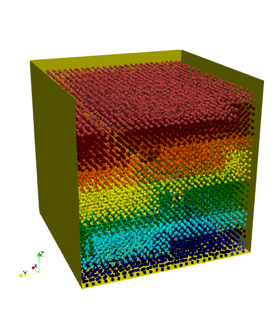

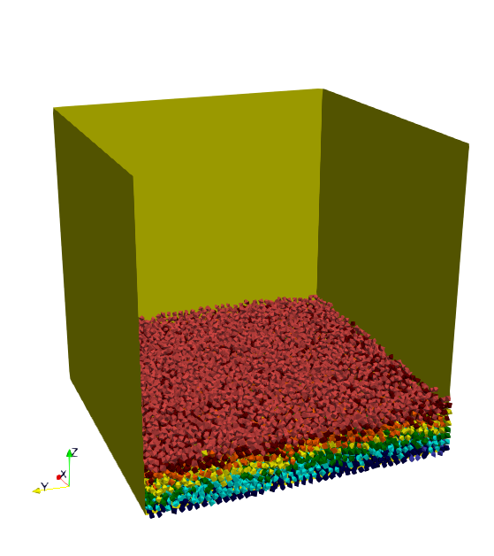

|anastart| |anaend|

A gnuplot script is available at `scripts/post_processing/avg_stress.gnu` to quickly plot lines:

.. code-block:: bash

	set key autotitle columnhead
	N = system("awk 'NR==1{print NF}' AvgStressTensor.txt")
	plot for [i=2:N] "AvgStressTensor.txt" u 1:i w l
	set key autotitle columnhead
	set term png
	set output "avgStress.png"
	replot

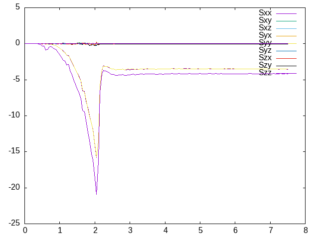

Particle Counter
^^^^^^^^^^^^^^^^

The purpose of this operator is to count the number of particles per type in a particular region. 

Operator:

* Name: ``particle_counter``
* Parameters:

  * `name`: Filename. Default is: ParticleCounter.txt,
  * `types`: List of particle types (required, [0,1,2, ...]),
  * `region`: Choose the region, default is the domain simulation.

To use this operator, the simplest way is to define the analysis frequency (all) in the global operator (``simulation_analyses_frequency``) and add the ``particle_count`` operator to the operator ``analyses``, as in the following example (see ``example/polyhedron/analysis/particle_counter.msp``: 	

.. code-block:: yaml

  global:
    simulation_analyses_frequency: 10000

  analyses:
    - particle_counter:
       name: "ParticleTypes0And1.txt"
       types: [0,1]
       region: BOX

One possibility for post-processing is to use gnuplot with the following commands: 

.. code-block:: bash

  set key autotitle columnheade
  set style data lines
  plot for [i=2:3] 'ExaDEMOutputDir/ExaDEMAnalyses/ParticleTypes0And1.txt' using 1:i smooth mcsplines

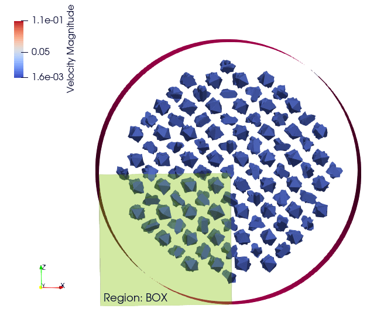

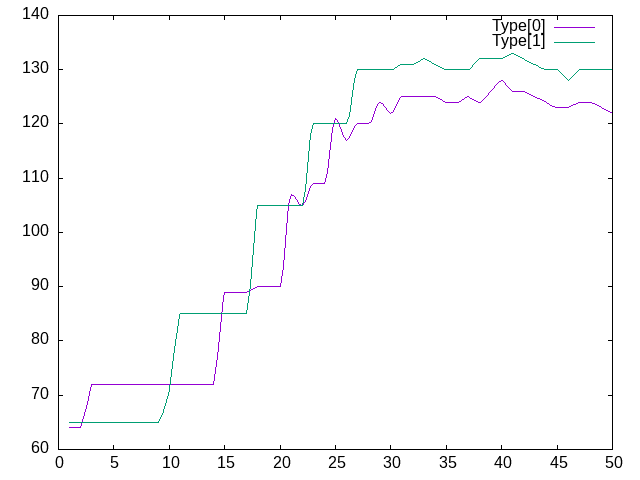

Results:

+--------------------------+--------------------------+
| .. centered:: Particle Counter Output               |
+--------------------------+--------------------------+
| .. centered:: Simulation | .. centered:: Plot       |
+==========================+==========================+
| |countergif|             | |counterplot|            |
+--------------------------+--------------------------+

Barycenter
^^^^^^^^^^

The purpose of this operator is to count the number of particles per type in a particular region. 

Operator:

* Name: ``particle_barycenter``
* Parameters:

  * `name`: Filename. Default is: ParticleBarycenter.txt,
  * `types`: List of particle types (required, [0,1,2, ...]),
  * `region`: Choose the region, default is the domain simulation.

To use this operator, the simplest way is to define the analysis frequency (all) in the global operator (``simulation_analyses_frequency``) and add the ``particle_count`` operator to the operator ``analyses``, as in the following example (see ``example/polyhedron/analysis/particle_barycenter.msp``: 	

.. code-block:: yaml

  global:
    simulation_analyses_frequency: 10000

  analyses:
    - particle_barycenter:
       name: BaraycenterBox.txt
       types: [0,1]
       region: BOX
    - particle_barycenter:
       name: Baraycenter.txt
       types: [0,1]

One possibility for post-processing is to use gnuplot with the following commands: 

.. code-block:: bash

  set key autotitle columnheade
  set style data lines
  set title font "Barycenter per particle type" 
  set xlabel "Position X" 
  set ylabel "Position Z"
  plot "PolyhedraAnalysisBarycenterDir/ExaDEMAnalyses/Baraycenter.txt" u 2:4 w l title "Poly"
  replot "PolyhedraAnalysisBarycenterDir/ExaDEMAnalyses/Baraycenter.txt" u 5:7 w l title "Octahedron"
  set terminal png
  set output "barycenter_plot.png"
  replot

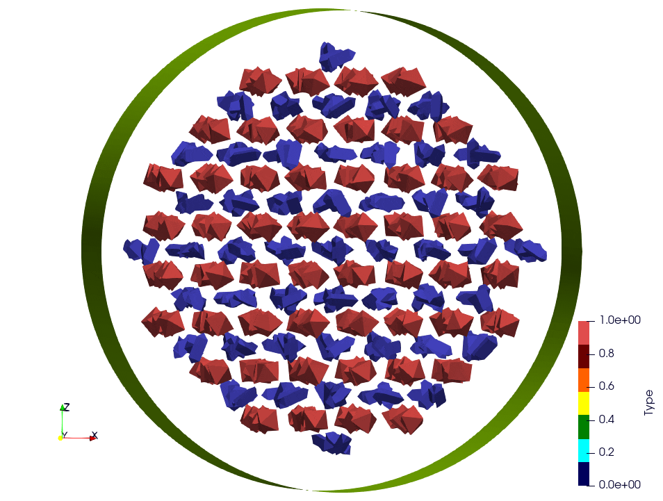

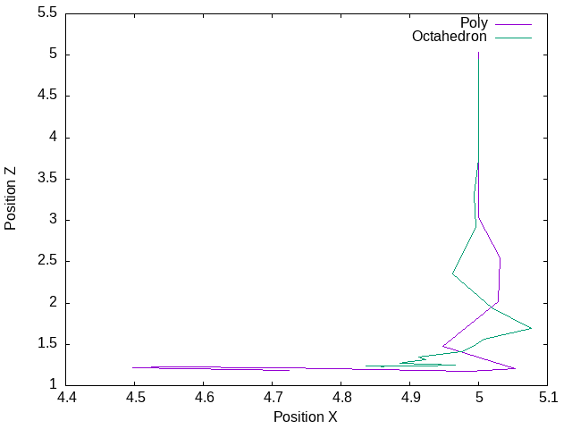

+--------------------------+--------------------------+
| .. centered:: Particle Counter Output               |
+--------------------------+--------------------------+
| .. centered:: Simulation | .. centered:: Plot       |
+==========================+==========================+
| |barycentergif|          | |barycenterplot|         |
+--------------------------+--------------------------+
  
