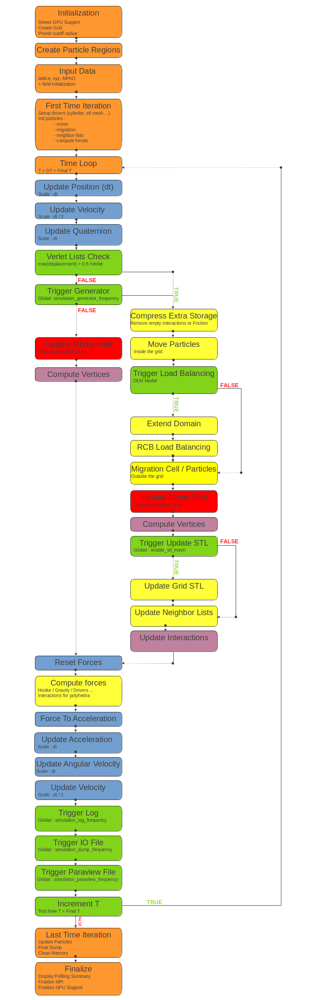

.. image:: ../_static/exaDEMlogo2.png
   :scale: 100 %
   :align: center

ExaDEM Software
===============

Overview of ExaDEM
^^^^^^^^^^^^^^^^^^

``ExaDEM`` is a software solution in the field of computational simulations. It's a Discrete Element Method (``DEM``) code developed within the ``exaNBody framework``. This framework provides the basis for DEM functionalities and performance optimizations. A notable aspect of ``ExaDEM`` is its hybrid parallelization approach, which combines the use of ``MPI`` (Message Passing Interface) and Threads (``OpenMP``). This combination aims to enhance computation times for simulations, making them more efficient and manageable.

Additionally, ``ExaDEM`` offers compatibility with ``MPI``+``GPUs``, using the ``CUDA`` programming model (Onika layer). This feature provides the option to leverage ``GPU`` processing power for potential performance gains in simulations. Written in ``C++17``, ``ExaDEM`` is built on a contemporary codebase. It aims to provide researchers and engineers with a tool for adressing ``DEM`` simulations.

ExaDEM Capabilities
^^^^^^^^^^^^^^^^^^^

The following table provides a glossary of features supported by ``ExaDEM``, categorized by their computational platform (``CPU`` or ``GPU``) and particle type (Sphere or Polyhedron). Please note that this information is indicative and may be subject to change based on updates or modifications to the ``ExaDEM`` framework.

.. list-table:: Features Glossary
  :widths: 40 15 15 15 15
  :header-rows: 1

  * - Features
    - Sphere(CPU)
    - Sphere(GPU)
    - Polyhedron(CPU)
    - Polyhedron(GPU)
  * - Field Set Plugin
    - YES
    - YES
    - YES
    - YES
  * - I/O Files
    - YES
    - X
    - YES
    - X
  * - Paraview Files
    - YES
    - X
    - YES
    - X
  * - Particle Migration (MPI)
    - YES
    - X
    - YES
    - X
  * - Load Balancing (RCB)
    - YES
    - X
    - YES
    - X
  * - Numerical Scheme Plugin
    - YES
    - YES
    - YES
    - YES
  * - Regions
    - YES
    - YES
    - YES
    - YES
  * - Particles Generator
    - YES
    - X
    - YES
    - X
  * - Hooke Law
    - YES
    - YES
    - YES
    - NO
  * - Gravity Force
    - YES
    - YES
    - YES
    - YES
  * - Quadratic Drag Force
    - YES
    - YES
    - YES
    - YES
  * - Driver Cylinder
    - YES
    - YES
    - YES
    - NO
  * - Driver Wall/Surface
    - YES
    - YES
    - YES
    - NO
  * - Driver type Ball/Sphere
    - NO
    - NO
    - YES
    - NO
  * - Driver type STL Mesh
    - LEGACY
    - LEGACY
    - YES
    - NO
  * - Contact Network File
    - NO
    - X
    - YES
    - X

Default Execution Graph With ExaDEM
^^^^^^^^^^^^^^^^^^^^^^^^^^^^^^^^^^^

``ExaDEM`` is based on the operator execution system implemented by the ``ExaNBody`` framework. In particular, this allows us to define a set of default operators for ``ExaDEM`` to run a ``DEM`` simulation following a default Verlet Vitesse integration scheme. ``ExaDEM`` offers two variants, depending on whether you want to simulate spherical particles only, or spheropolyhedron particles. To choose between these two variants, you'll need to include either *config_spheres.msp* or *config_polyhedra.msp* at the beginning of your input file. If neither is defined, the simulation will not work. Including these files allows you to override certain operators left at *nop* (for no operation). The graph below shows the sequence of ``exaDEM``'s main operators. 

.. note::
  - Violet: These operators are only called with the polyhedra variant.
  - Blue: Numerical time scheme operators.

